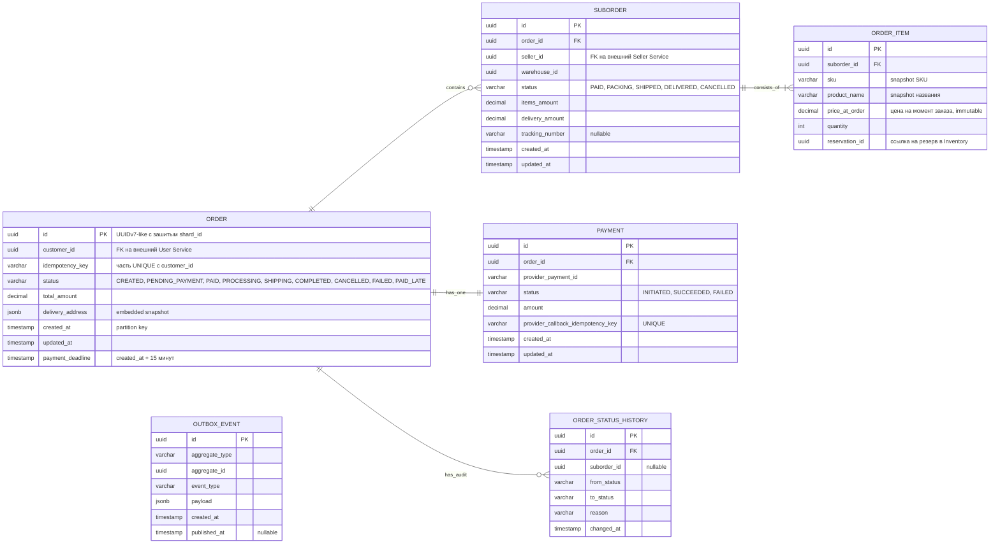
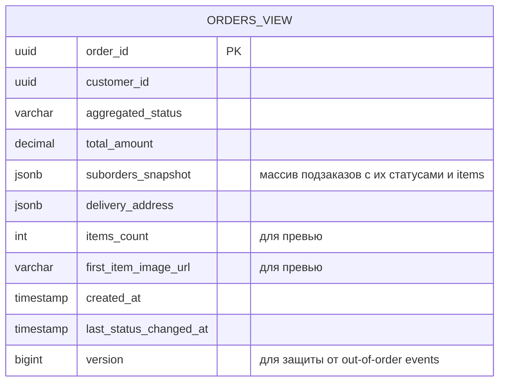
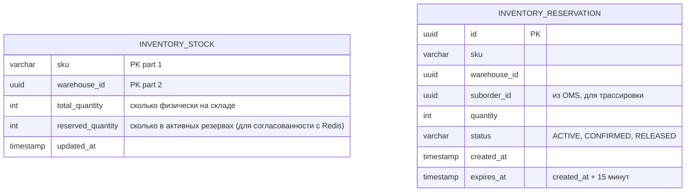
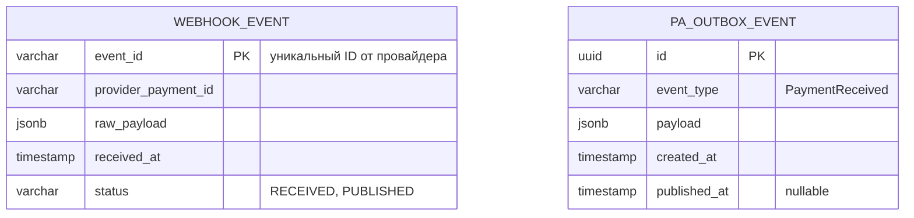
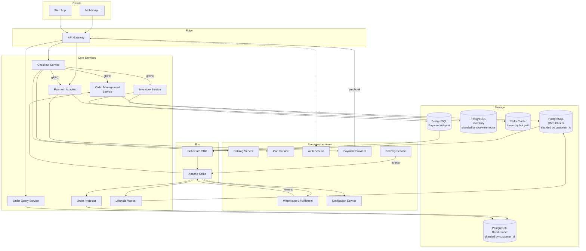
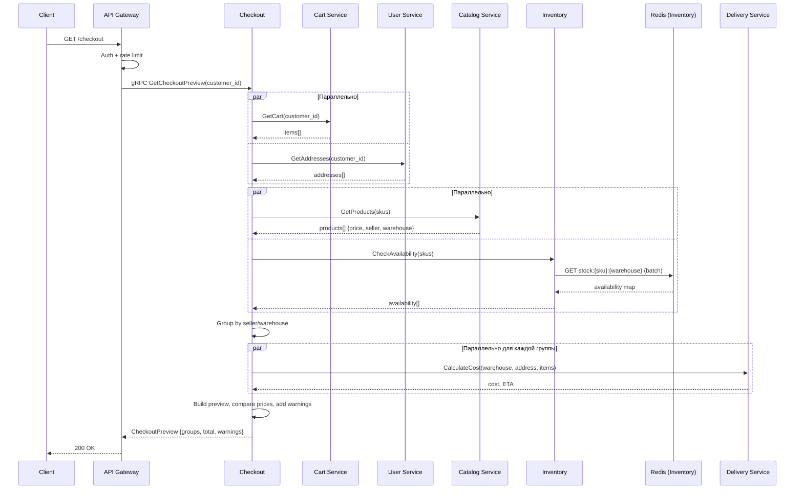
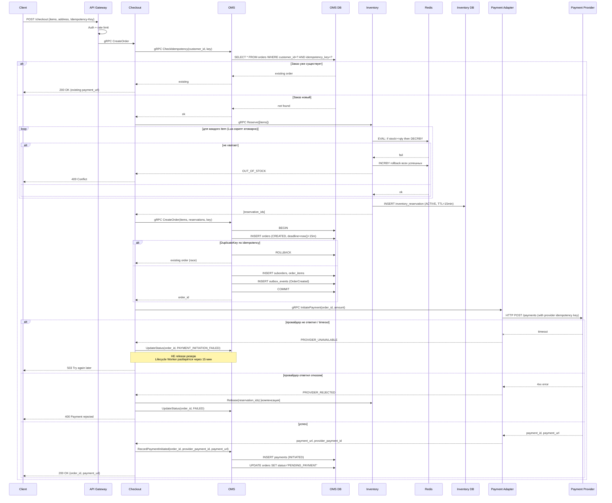
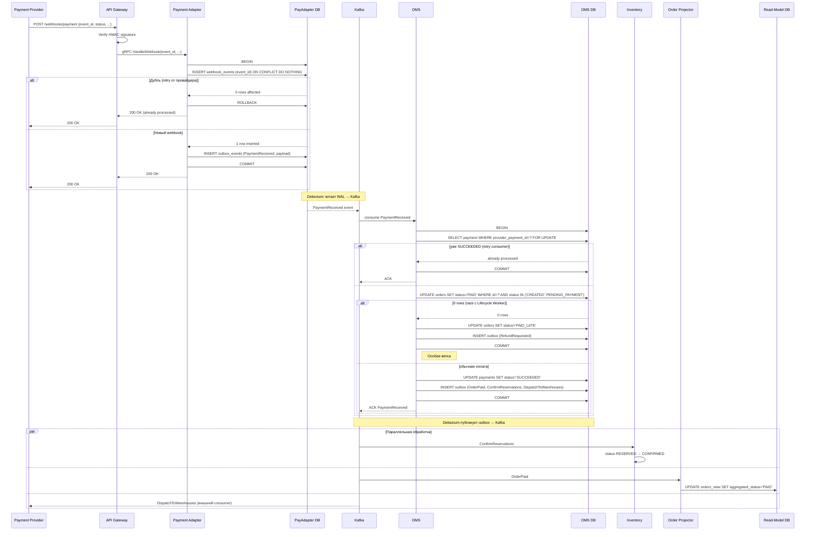
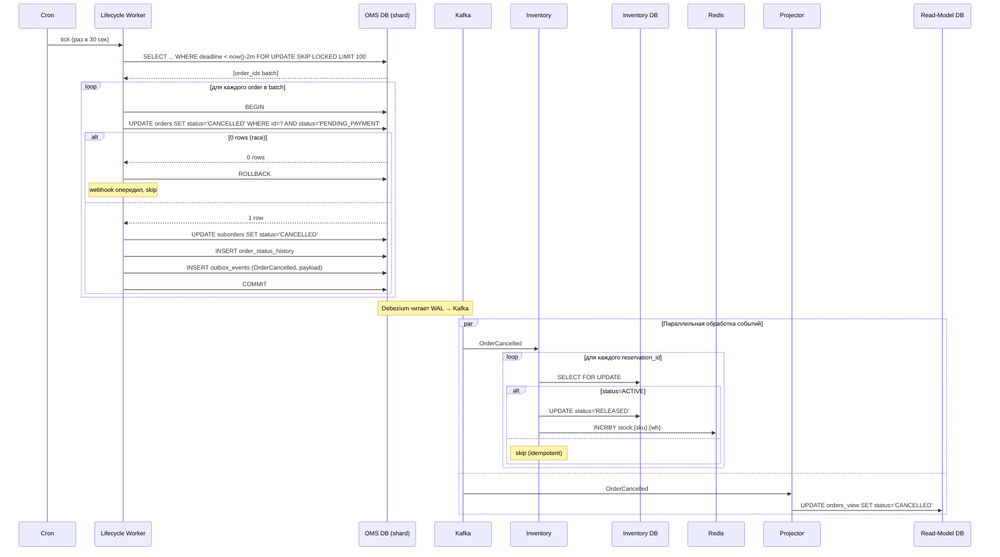
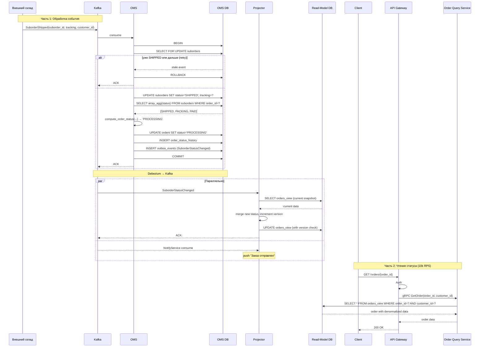

# Техническое решение: Оформление заказа на маркетплейсе

## 1. Введение

«Заказ товара на маркетплейсе» — это техническое решение для системы оформления заказов в B2C-маркетплейсе с многими селлерами. Проект сосредоточен на критическом пути от инициации чекаута до подтверждения оплаты заказа и его передачи в фулфилмент. Архитектура построена с учётом высоких нагрузок (целевая аудитория 30 млн MAU, до 150 RPS на запись и 10k RPS на чтение в пиковых сценариях), требований к финансовой консистентности и устойчивости к сбоям.

Ключевые архитектурные принципы: микросервисная декомпозиция с изоляцией хранилищ, CQRS-разделение записи и чтения через event-driven обновление read-model, распределённая транзакция через паттерн Saga с явными компенсациями, идемпотентность всех изменяющих операций на нескольких уровнях, и Transactional Outbox для надёжной интеграции с Kafka.

---

## 2. Глоссарий

| Термин | Определение |
|---|---|
| Маркетплейс | Платформа, агрегирующая множество селлеров и предоставляющая покупателям единый интерфейс для покупки их товаров. |
| Покупатель (Customer) | Зарегистрированный пользователь, оформляющий заказы. |
| Селлер (Seller) | Внешний продавец, имеющий товары на маркетплейсе. В рамках scope — внешний субъект. |
| Заказ (Order) | Агрегатная сущность верхнего уровня, объединяющая покупки покупателя у разных селлеров в рамках одной транзакции оформления. |
| Подзаказ (Suborder) | Часть заказа, относящаяся к одному селлеру/складу. Имеет независимый жизненный цикл (сборка, отгрузка, доставка). |
| Чекаут (Checkout) | Процесс оформления заказа от нажатия «Оформить» до перенаправления на платёжную страницу. |
| Inventory Reservation | Временная блокировка остатка товара на время от создания заказа до его оплаты. |
| Idempotency-Key | Уникальный идентификатор запроса от клиента, обеспечивающий безопасный повтор операций без дублирования. |
| Saga | Паттерн распределённой транзакции через последовательность локальных транзакций в разных сервисах с компенсирующими действиями при сбоях. |
| Transactional Outbox | Паттерн надёжной публикации событий: запись события в outbox-таблицу в рамках транзакции БД, асинхронная публикация в брокер отдельным процессом. |
| CQRS (Command Query Responsibility Segregation) | Разделение записи (command side) и чтения (query side) с независимыми моделями данных. |
| Read-Model | Денормализованная проекция данных, оптимизированная для чтения. Обновляется асинхронно через события. |
| Order Projector | Сервис, обновляющий read-model на основе событий из Kafka. |
| CDC (Change Data Capture) | Технология (Debezium) для отслеживания изменений в БД через WAL и публикации их в брокер. |
| At-least-once delivery | Гарантия, что сообщение будет доставлено как минимум один раз; возможны дубликаты, обрабатываемые на стороне consumer'а через идемпотентность. |
| Eventual consistency | Модель согласованности, при которой данные в разных узлах системы согласуются спустя некоторое время. |
| Shard | Логически независимый сегмент БД с собственной частью данных. Шардирование позволяет горизонтально масштабировать запись. |
| Hot Product | Товар с непропорционально высокой конкурентной нагрузкой (популярный товар в распродажу). Источник race conditions на остатки. |
| Lifecycle Worker | Фоновый сервис, обрабатывающий отложенные операции жизненного цикла заказа (таймауты оплаты, повторные попытки). |
| Webhook | HTTP-вызов от внешней системы (платёжного провайдера) для уведомления об асинхронном событии. |
| API Gateway | Входная точка системы, отвечающая за аутентификацию, маршрутизацию, rate limiting и приём webhook'ов. |
| P95 Latency | 95-й перцентиль времени отклика: 95% запросов обрабатываются быстрее этой границы. |
| RPS (Requests Per Second) | Количество запросов в секунду — метрика нагрузки. |
| MAU / DAU | Monthly / Daily Active Users — количество уникальных активных пользователей за месяц/день. |

---

## 3. Функциональные требования

### 3.1. Перечень функциональных требований

**ФТ-1. Открытие чекаута.** Пользователь, имея корзину, может перейти к оформлению. Система: проверяет актуальность товаров (наличие, цена), рассчитывает стоимость доставки по селлерам, формирует список подзаказов, возвращает финальную сумму.

**ФТ-2. Создание заказа.** Пользователь подтверждает оформление. Система: резервирует товары на складах атомарно (защита от oversell), создаёт заказ и подзаказы, инициирует оплату у платёжного провайдера, возвращает пользователю URL для оплаты.

**ФТ-3. Идемпотентность чекаута.** Повторный запрос на создание заказа с тем же `Idempotency-Key` не создаёт дубликат, а возвращает результат первого запроса.

**ФТ-4. Обработка callback от платежа.** При получении webhook от платёжного провайдера система переводит заказ в статус `PAID`, инициирует фулфилмент (отправляет события на склады по подзаказам).

**ФТ-5. Обработка таймаута оплаты.** Если за 15 минут оплата не пришла, заказ автоматически отменяется, резерв товаров снимается.

**ФТ-6. Обработка событий жизненного цикла подзаказа.** Когда внешняя система (склад/доставка) сообщает о смене статуса подзаказа (`PACKING → SHIPPED → DELIVERED`), система обновляет статус подзаказа и пересчитывает агрегатный статус заказа.

**ФТ-7. Получение статуса заказа.** Пользователь может запросить актуальный статус только что оформленного заказа: общий статус, статусы подзаказов, трек-номера, ожидаемая дата доставки.

### 3.2. Архитектурные ограничения и принципы

1. **Saga as a transaction model.** Распределённая транзакция «зарезервировать товар → создать заказ → инициировать оплату» реализуется через паттерн Saga с явными компенсациями, без 2PC.
2. **Idempotency multilayer.** Все конечные точки API, изменяющие данные, идемпотентны. Защита реализована на трёх уровнях: клиент↔Checkout, PaymentAdapter↔Provider, Provider↔Webhook.
3. **CQRS by design.** Запись и чтение разделены на разные сервисы и хранилища.
4. **Eventual consistency допустима** между write side и read side в пределах SLA (типично <1 сек).
5. **Single currency** (только рубли), без поддержки промокодов, бонусных программ, частичной оплаты.
6. **Out of scope:** изменение состава заказа после создания, отмена покупателем, отмена селлером, возвраты и споры, антифрод, KYC, управление селлерами.

---

## 4. Нефункциональные требования

### 4.1. Масштаб системы

| Метрика | Значение |
|---|---|
| MAU | 30 млн |
| DAU | 5 млн (≈17% от MAU) |
| Заказов в день | 250 000 (5% конверсия от DAU) |
| Заказов в секунду в пике (распродажа) | 150 RPS |
| Заказов в секунду в обычном пике | 15 RPS |

### 4.2. Нагрузка по операциям

| Операция | Пиковый RPS | Тип |
|---|---|---|
| Чтение состояния заказа (Order Query) | 10 000 | Read |
| Создание заказа (Checkout) | 150 | Write |
| Webhook'и от платежей | 150 | Write |
| События от складов/доставки | 500 | Write |
| Попытки резервирования товара | 500 | Write |

Соотношение чтение/запись: ~67:1 — read-heavy профиль, обосновывающий CQRS.

### 4.3. Latency-цели

**Синхронные операции (пользователь ждёт):**
- Открытие чекаута (расчёт корзины + доставки): P95 ≤ 500 мс
- Создание заказа после нажатия «Оплатить»: P95 ≤ 1000 мс
- Получение статуса заказа: P95 ≤ 200 мс

**Асинхронные операции:**
- Обработка callback от платежа → обновление статуса: P95 ≤ 5 сек
- Передача заказа на склад: P95 ≤ 30 сек
- Уведомление пользователю: P95 ≤ 10 сек

### 4.4. Доступность

- Доступность чекаута: **99.95%** (~4.5 часа простоя в год). Критический путь, потеря денег при простое.
- Доступность чтения статуса: **99.9%**.
- Доступность интеграций со складами: **99%** (допустима деградация: заказ принимается, передача на склад — eventual).

### 4.5. Корректность и надёжность

- **Нулевая терпимость к потере оплаченного заказа** (деньги списали — заказ обязан существовать).
- **Невозможность oversell** (защита остатков от состояний гонки).
- **Идемпотентность всех изменяющих операций** на нескольких уровнях.
- **Eventual consistency между подсистемами** допустима в пределах SLA.

---

## 5. Пользовательские сценарии

### Сценарий: Оформление заказа

1. Покупатель находится на странице корзины и нажимает «Оформить заказ».
2. Система открывает чекаут: показывает товары, сгруппированные по селлерам, актуальные цены, варианты доставки для каждой группы, итоговую сумму.
3. Покупатель выбирает адрес доставки и способ оплаты.
4. Покупатель нажимает «Перейти к оплате».
5. Система резервирует выбранные товары, создаёт заказ, инициирует оплату у платёжного провайдера, перенаправляет покупателя на страницу оплаты.
6. Покупатель оплачивает заказ на стороне провайдера и возвращается в приложение.
7. Покупатель видит подтверждение оформления заказа и его актуальный статус («Заказ #12345 принят, ожидает оплаты» → через несколько секунд статус обновляется на «Оплачен»).

**Альтернативные ветки:**
- 2a. Какой-то товар стал недоступен → показываем предупреждение, предлагаем убрать товар.
- 2b. Цена товара изменилась → показываем новую цену, требуем подтверждения.
- 5a. Не удалось зарезервировать товар (раскупили в момент чекаута) → показываем ошибку, заказ не создаётся.
- 7a. Покупатель не оплатил в течение 15 минут → заказ автоматически отменяется, резервы снимаются, покупатель получает уведомление.

---

## 6. Модель данных

В системе используется четыре независимых хранилища: основная БД OMS (write side), read-model БД OMS (read side), БД Inventory Service, и небольшая БД Payment Adapter для idempotency-лога. Каждое хранилище шардируется по своему ключу, выбранному исходя из паттерна доступа.

### 6.1. OMS Write Side (основная БД заказов)



**Ключевые решения:**

- **`ORDER.id` как UUIDv7-like** с зашитым `shard_id`. Первые биты — timestamp (для лексикографической сортировки B-tree индексов), несколько бит — номер шарда, остальные — random. Приложение извлекает шард прямо из идентификатора, что обеспечивает прямой роутинг.
- **Идемпотентность через unique constraint** `(customer_id, idempotency_key)`. Привязка к пользователю исключает кросс-юзерные коллизии UUID.
- **`delivery_address` как embedded JSONB** — иммутабельный snapshot на момент заказа.
- **`price_at_order` snapshot** — цена в каталоге может меняться, в заказе остаётся согласованная.
- **`reservation_id` без FK** — это ссылка на резерв в другой БД (Inventory). Cross-service референс.
- **`provider_callback_idempotency_key` в PAYMENT** — защита от повторной обработки webhook'ов от провайдера.
- **`OUTBOX_EVENT`** — таблица для Transactional Outbox pattern. Записи добавляются в той же транзакции, что и бизнес-данные. Debezium читает Postgres WAL и публикует в Kafka.
- **`ORDER_STATUS_HISTORY`** — аудит-лог изменений для саппорта и дебага.

**Индексы:**
- `ORDER`: PK (id), UNIQUE (customer_id, idempotency_key), INDEX (customer_id, created_at DESC), INDEX (status, payment_deadline) для Lifecycle Worker.
- `SUBORDER`: PK (id), INDEX (order_id), INDEX (seller_id, status).
- `OUTBOX_EVENT`: INDEX (published_at IS NULL) для эффективного выбора неопубликованных.

**Шардирование:** по `customer_id` (зашитый в UUID). Все заказы одного покупателя — на одном шарде.
**Партиционирование:** по `created_at` (по месяцам) — упрощает архивирование старых заказов и vacuum.

### 6.2. OMS Read Side (read-model для чтения)



**Ключевые решения:**
- Один документ на заказ — никаких джойнов.
- `suborders_snapshot` как JSONB — все подзаказы в одной записи.
- Денормализация `first_item_image_url`, `items_count` — для быстрого превью без обращений к каталогу.
- `version` — монотонный счётчик из source side для защиты от применения устаревших событий.
- Шардирование тем же ключом, что и write side (`customer_id`) — projector пишет в тот же шард, что и source.
- Каждый шард имеет master + 3 read replicas для обработки 10k RPS на чтение.

**Индексы:**
- INDEX (customer_id, created_at DESC) — основной запрос «Мои заказы».
- INDEX (customer_id, aggregated_status, created_at DESC) — для фильтра по статусу.

### 6.3. Inventory Service



**Ключевые решения:**
- Композитный PK `(sku, warehouse_id)` в `INVENTORY_STOCK`.
- Шардирование по `(sku, warehouse_id)`.
- БД хранит источник правды; Redis — горячий путь для атомарного резервирования.

**Структура в Redis:**
```
stock:{sku}:{warehouse_id} → int (доступно к резервированию)
reservation:{reservation_id} → hash {sku, warehouse_id, qty, expires_at}, TTL 900 сек
```

**Жизненный цикл резерва:**
- `ACTIVE` — резерв создан, ждём оплаты.
- `CONFIRMED` — оплата прошла, резерв «закреплён».
- `RELEASED` — отмена или таймаут.

**Сверка Redis ↔ БД:** фоновый процесс Inventory Reconciler раз в 5 минут проходит по SKU/warehouse, считает в БД сумму активных резервов и сверяет с Redis-счётчиком. При расхождении переписывает Redis из БД (БД — source of truth).

### 6.4. Payment Adapter Service (служебная БД)



**Ключевые решения:**
- Маленькая БД исключительно для idempotency webhook'ов и Outbox.
- Не хранит сами `PAYMENT` — это в OMS.
- При получении webhook: INSERT в `webhook_events` ON CONFLICT DO NOTHING — атомарная дедупликация.
- Если новый webhook — INSERT в `pa_outbox_events`, Debezium публикует в Kafka.

---

## 7. Архитектура

### 7.1. Компоненты системы

Архитектура построена на 8 сервисах с изоляцией хранилищ, акцентом на event-driven обработку и CQRS.

**1. API Gateway** — входная точка для всех клиентских запросов. Аутентификация JWT, маршрутизация, rate limiting, TLS termination, приём webhook'ов от внешних систем.

**2. Checkout Service** — синхронный сервис чекаута. Открывает чекаут (read-heavy сценарий с параллельными вызовами внешних сервисов) и оркестрирует Saga при создании заказа.

**3. Order Management Service (OMS)** — хозяин жизненного цикла заказов. Хранит заказы, обрабатывает события статусов, публикует бизнес-события через Outbox.

**4. Inventory Service** — управление резервированием товаров. gRPC API: `Reserve`, `Release`, `Confirm`. Redis для горячего пути + PostgreSQL для аудита.

**5. Payment Adapter** — обёртка над платёжным провайдером. Инициация платежей, приём и нормализация webhook'ов, публикация в Kafka через Outbox.

**6. Order Projector** — Kafka consumer, обновляющий read-model на основе событий из OMS.

**7. Order Query Service** — синхронный сервис чтения заказов. Читает только из read-model.

**8. Lifecycle Worker** — фоновый сервис для отложенных операций (таймауты оплаты, retries). Развёртывается как пул реплик с использованием `FOR UPDATE SKIP LOCKED` для конкурентной выборки заданий.

**Инфраструктурные компоненты:**
- PostgreSQL OMS Cluster (sharded by customer_id) — 8 шардов × (master + 3 replicas).
- PostgreSQL Read-Model Cluster (sharded by customer_id) — 8 шардов × (master + 3 replicas).
- PostgreSQL Inventory Cluster (sharded by sku/warehouse).
- PostgreSQL Payment Adapter DB (одна нода).
- Redis Cluster для горячего пути Inventory.
- Apache Kafka — брокер событий.
- Debezium — CDC из Postgres WAL в Kafka.

### 7.2. Архитектурная диаграмма



### 7.3. Обоснование разделения на сервисы

| Сервис | Обоснование |
|---|---|
| Checkout vs OMS | Разный профиль: Checkout — оркестратор синхронной saga (read-heavy + параллельные вызовы), OMS — хозяин жизненного цикла (write-heavy, event-driven). |
| Inventory vs OMS | Своё хранилище (Redis), специфичная нагрузка (атомарные операции), шардирование по другому ключу (sku/warehouse vs customer_id). |
| Payment Adapter vs OMS | Изоляция внешней зависимости. При смене провайдера — меняется только адаптер. Своя БД для idempotency log. |
| Query vs OMS | Классический CQRS. Read/write ratio 67:1, разные паттерны масштабирования. |
| Projector vs Query | Projector — write-side для read-model, Query — read-side. Изоляция нагрузок. |
| Lifecycle Worker | Фоновые задачи не должны делить ресурсы с user-facing OMS. Изоляция отказов. |

### 7.4. Sync vs Async

**Синхронные пути (юзер ждёт):**
- Mobile/Web → Gateway → Checkout → Inventory + OMS + Payment Adapter
- Mobile/Web → Gateway → QueryAPI → Read-model

**Асинхронные пути (через Kafka):**
- OMS → Outbox → Kafka → Projector / Notification / Warehouse
- Payment Adapter → Outbox → Kafka → OMS (обработка PaymentReceived)
- Warehouse → Kafka → OMS (обновление статусов подзаказов)
- Worker → OMS_DB → Outbox → Kafka

**Принцип разделения:** всё, что относится к критическому пути «оформить заказ → перейти к оплате» — синхронно. Всё после оплаты — async.

### 7.5. Транспорт

- **REST/JSON** — снаружи (Mobile/Web → Gateway).
- **gRPC** — внутри (между сервисами). Бинарный протокол, contract-first через Protobuf, HTTP/2 multiplexing.
- **Apache Kafka** — асинхронные события. Высокий throughput, persistence, возможность переигрывания.

### 7.6. Гарантии доставки и идемпотентность

**Transactional Outbox** обеспечивает at-least-once delivery событий из OMS и Payment Adapter в Kafka. Запись события в `outbox_events` происходит в той же БД-транзакции, что и бизнес-операция. Debezium асинхронно читает WAL и публикует в Kafka.

**Идемпотентность многослойная:**
1. **Клиент → Checkout**: `Idempotency-Key` в заголовке + UNIQUE в `orders.idempotency_key`.
2. **Payment Adapter → Provider**: свой UUID, отправляемый провайдеру.
3. **Provider → нас (webhook)**: `event_id` от провайдера + UNIQUE в `webhook_events`.
4. **Kafka consumers**: idempotent processing через статусные проверки и версионирование.

---

## 8. Технические сценарии

### 8.1. Открытие чекаута

**Цель:** построить preview заказа (без создания) — товары, цены, доставка, итоговая сумма.

**Особенности:**
- Read-only сценарий, никаких записей.
- 5 параллельных вызовов внешних сервисов (Cart, User, Catalog, Inventory, Delivery).
- Параллелизация обязательна для P95 ≤ 500 мс.



**Highload-аспекты:**
- Параллелизация снижает latency с суммы (~250 мс) до максимума (~50 мс).
- `Inventory.CheckAvailability` — быстрая read-операция по Redis, без блокировок.
- Read-only характер позволяет неограниченно масштабировать Checkout Service горизонтально.
- Graceful degradation: при недоступности Delivery возвращается preview с placeholder, при недоступности Catalog/Cart — fail-fast.

### 8.2. Создание заказа

**Цель:** создать заказ с резервом товаров и инициированным платежом. Saga из 3 шагов с компенсациями.

**Алгоритм:**
1. Проверить идемпотентность.
2. Reserve товары в Inventory (атомарно через Lua-скрипт в Redis + INSERT в БД).
3. CreateOrder в OMS (локальная транзакция в шарде customer_id).
4. InitiatePayment у провайдера через Payment Adapter.
5. Записать payment в OMS, обновить статус на PENDING_PAYMENT.
6. Вернуть payment_url клиенту.

**Компенсации:**
- Reserve успешен, OMS падает → `Inventory.Release(reservations)`.
- OMS успешен, Provider падает → если timeout — оставляем `PAYMENT_INITIATION_FAILED`, ждём Worker; если отказ — Release + статус FAILED.



**Highload-аспекты:**
- **Конкуренция за hot products** решается атомарным Lua-скриптом в Redis, который сериализует операции по одному ключу за микросекунды без блокировок в БД.
- **Многослойная идемпотентность**: `Idempotency-Key` от клиента → unique constraint в `orders`; собственный idempotent key в Payment Adapter → провайдер.
- **Saga с явными компенсациями**: каждый шаг компенсируется при partial failure.
- **Outbox pattern** в шаге CreateOrder: `outbox_events` пишется в той же транзакции, что и `orders`.
- **Bottleneck-анализ**: внешний провайдер (~500 мс) — главный латентный bottleneck; БД OMS на одном шарде имеет запас 10x от целевой нагрузки; Redis Inventory имеет запас 100x.
- **Consistency over availability при timeout провайдера**: при недоступности провайдера резерв не отпускается синхронно (риск oversell, если запрос всё-таки прошёл к провайдеру). Lifecycle Worker через 15+2 минут гарантированно разберётся.

### 8.3. Обработка callback оплаты

**Цель:** надёжно обработать webhook от провайдера, перевести заказ в PAID, инициировать фулфилмент через events.

**Особенности:**
- Webhook may be retried by provider — нужна дедупликация.
- Async fan-out через Kafka к нескольким consumers.
- Возможен race с Lifecycle Worker (см. раздел «Особые случаи»).



**Highload-аспекты:**
- **Idempotency на двух уровнях**: `event_id` в `webhook_events` (от провайдера) и `provider_payment_id` в `payments` (для Kafka consumer retry).
- **At-least-once delivery + idempotent processing = effective exactly-once.**
- **Async fan-out через Kafka**: одно событие OrderPaid → 3+ параллельных подписчика, каждый развязан во времени и независим.
- **Transactional Outbox в Payment Adapter**: webhook не теряется даже при сбое адаптера между ответом провайдеру и публикацией.
- **Eventual consistency**: от COMMIT в OMS_DB до видимости в read-model — типично <1 сек.

### 8.4. Таймаут оплаты (Lifecycle Worker)

**Цель:** автоматически отменить заказы, оплата которых не пришла в срок, и снять резервы.

**Особенности:**
- Polling по шардам с конкурентным доступом через `FOR UPDATE SKIP LOCKED`.
- Buffer 2 минуты для исключения race с поздним webhook.
- Release резервов через Kafka, а не gRPC — для развязки и at-least-once гарантии.



**Highload-аспекты:**
- **`FOR UPDATE SKIP LOCKED`** — нативный паттерн PostgreSQL для конкурентной обработки заданий несколькими worker-инстансами без distributed lock.
- **Batch size 100** — компромисс между overhead итераций и длительностью блокировок.
- **Развёртывание как пул** — любой worker может взять любой шард, что упрощает деплой и обеспечивает естественную балансировку.
- **Release через Kafka**: Worker отвечает только за надёжную запись в OMS_DB через outbox, Inventory подхватывает асинхронно. Гарантия at-least-once.
- **Идемпотентность Inventory consumer**: проверка `status='ACTIVE'` перед UPDATE защищает от двойного возврата товара.
- **Bottleneck-анализ**: 8 шардов × 30 batch'ей/мин × 100 заказов = 24000/мин = 400/сек. Запас 10x от пиковой нагрузки отмен.

### 8.5. Обработка событий жизненного цикла + чтение статуса

**Цель:** обработать событие смены статуса подзаказа от внешней системы (склад/доставка), обновить write side, спроецировать в read-model. Обеспечить быстрое чтение статуса пользователем.



**Highload-аспекты:**
- **Read path полностью изолирован от write**: Query Service не имеет доступа к OMS_DB.
- **Шардирование = отсутствие scatter**: запрос с `customer_id` в JWT → прямой роутинг в нужный шард → нет cross-shard query.
- **Versioning против out-of-order events**: Projector обновляет read-model только если версия события больше последней применённой.
- **Read replicas для масштабирования чтения**: каждый шард имеет master + 3 read replicas. 10k RPS распределяется на (8 × 3) = 24 реплики ≈ 400 RPS на реплику. Запас огромный.
- **Eventual consistency**: лаг от COMMIT до видимости — миллисекунды-секунды. Допустимо для UX.

### 8.6. Особые случаи

#### Случай 1: Race между Lifecycle Worker и webhook оплаты

**Ситуация:** пользователь оплатил на 14:59 минуте. Worker мог успеть отменить заказ до того, как webhook от провайдера дошёл.

**Решение:**
1. Buffer 2 минуты в Worker'е: `payment_deadline < now() - interval '2 minutes'`.
2. Условный UPDATE при обработке webhook: `WHERE status IN ('CREATED', 'PENDING_PAYMENT')`.
3. Ветка `PAID_LATE`: при 0 rows обновлено — заказ переводится в `PAID_LATE`, инициируется автоматический возврат денег у провайдера, пользователь получает извинительное уведомление.

**Trade-off:** consistency над availability. Лучше редкий «опоздавший платёж» с автоматическим refund, чем потерянная оплата.

#### Случай 2: Двойная обработка webhook'а Kafka consumer'ом

**Ситуация:** OMS-консьюмер обработал событие, успел COMMIT, но не успел ACK в Kafka (упал, рестарт). Kafka переотправит то же событие.

**Решение:**
- В `payments` unique constraint на `provider_callback_idempotency_key`.
- Перед обновлением OMS делает `SELECT ... FOR UPDATE` — если уже SUCCEEDED, выходим, ACK событие.
- Аналогично для Inventory (check `status='ACTIVE'`) и Projector (version check).

**Гарантия:** at-least-once delivery + idempotent processing = effective exactly-once.

#### Случай 3: Расхождение Redis ↔ Inventory_DB

**Ситуация:** Redis потерял часть данных при failover, или INSERT в БД не прошёл после успешного DECRBY.

**Решение:**
- Фоновый процесс **Inventory Reconciler** раз в 5 минут проходит по SKU/warehouse, считает в БД сумму активных резервов и сверяет с Redis-счётчиком.
- При расхождении: alert в мониторинг + переписывает Redis-значение из БД (БД — source of truth).
- Окно неконсистентности до 5 минут — допустимо. Минорные oversell в этом окне разрешаются операционно (саппорт + возврат).

#### Случай 4: Hot Partition в Kafka

**Ситуация:** партиционирование по `sku` создаёт hot partition при большом количестве событий по одному популярному товару.

**Решение:**
- Большинство топиков партиционируются по `order_id` / `customer_id` — равномерно.
- Для `inventory_*` топиков использовать composite key `(sku, warehouse_id)` — разносит нагрузку по складам одного SKU.
- Если и этого мало — события Inventory не критичны для синхронизации, можно вынести в отдельный топик без жёстких гарантий порядка.

---

## 9. Компромиссы и ограничения

Сознательные ограничения и trade-off'ы:

1. **Scope ограничен оформлением.** Не моделируются: отмена покупателем, отмена селлером, возвраты, споры, изменение состава заказа после оформления, изменение адреса доставки, объединение/разделение заказов.
2. **Single currency** — только рубли.
3. **No promotion engine** — нет промокодов, скидок, бонусов, частичной оплаты бонусами.
4. **No fraud check** — антифрод упоминается как точка расширения, не проектируется.
5. **No KYC, no auth** — пользователь авторизован JWT из внешнего Auth Service, мы только валидируем.
6. **Saga вместо 2PC.** Распределённые транзакции через сагу с компенсациями. 2PC отвергнут из-за внешнего провайдера платежей (нет распределённой транзакции с внешней системой).
7. **Eventual consistency между write и read side** допустима в пределах <1 сек.
8. **Hot products решаются на горячем пути через Redis**, БД не участвует в синхронной критичной операции. Цена — окно расхождения Redis↔БД до 5 минут.
9. **Полное шардирование с самого начала.** Нагрузка пограничная для одной ноды, но шардирование обосновано как стратегическое решение под рост и распродажные пики ×5–10.
10. **Замена платёжного провайдера** возможна без изменения OMS — только заменой Payment Adapter.

---

## 10. Заключение

Техническое решение покрывает критический путь оформления заказа в B2C-маркетплейсе. Архитектурные решения мотивированы конкретными цифрами нагрузки и требованиями к финансовой консистентности:

- **CQRS** обоснован read/write ratio 67:1.
- **Saga** обоснована наличием внешнего платёжного провайдера.
- **Hybrid storage Inventory (Redis + Postgres)** обоснован конкуренцией за hot products.
- **Шардирование** обосновано целевым ростом и распродажными пиками.
- **Outbox + Debezium** обоснованы требованием at-least-once для финансовых событий.
- **Идемпотентность многослойная** обоснована ненадёжностью сетевых вызовов на каждой границе.

Решение является целостной системой с явно обозначенными границами scope, согласованными ФТ ↔ модель данных ↔ архитектура ↔ технические сценарии, и проработанными highload-аспектами на каждом уровне.
