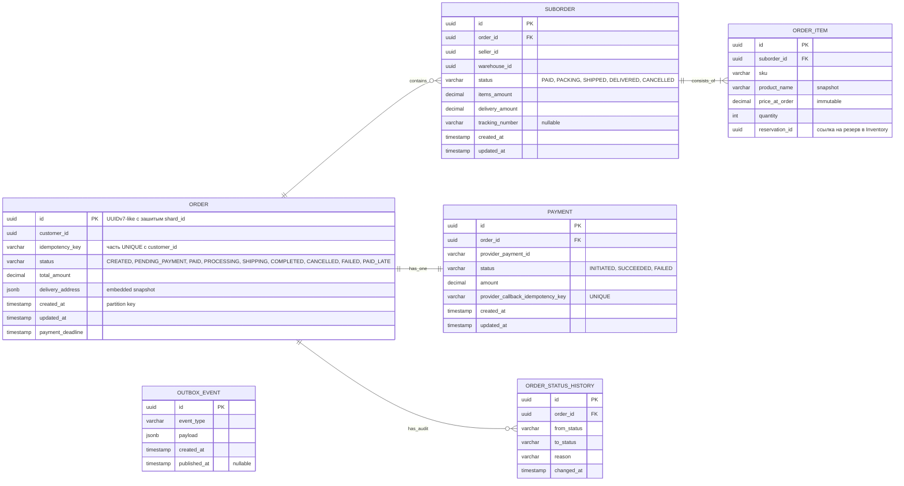
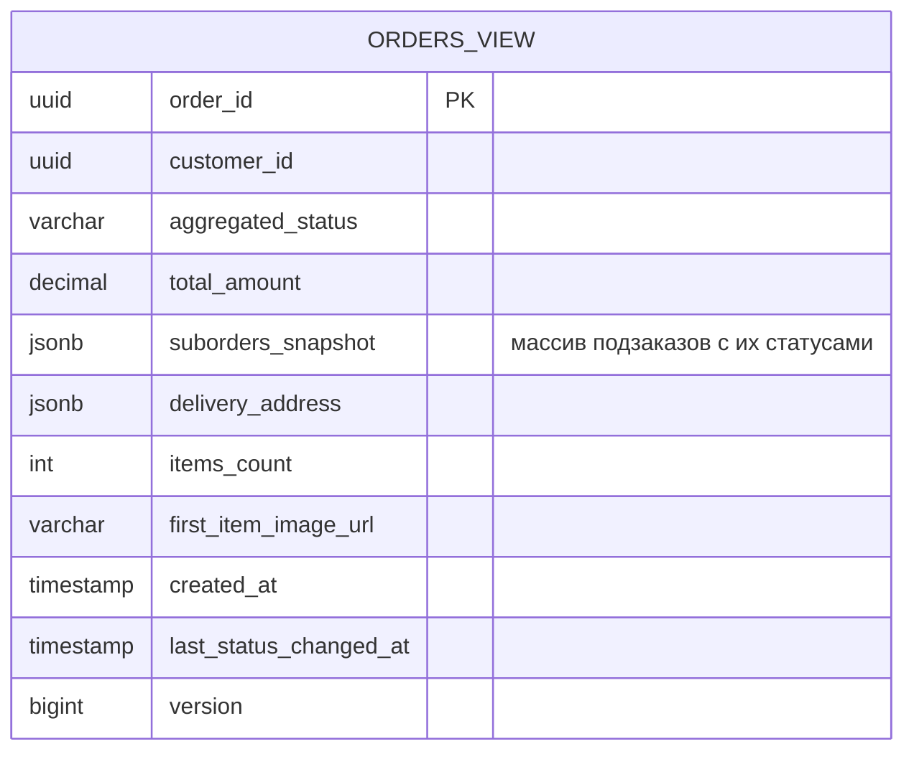
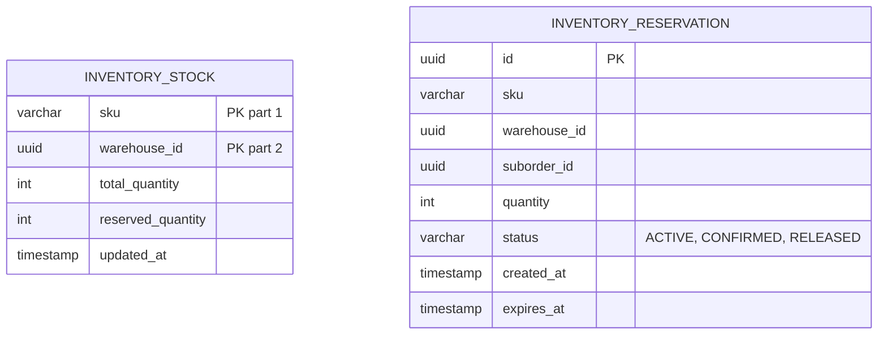
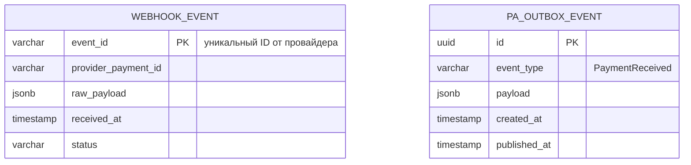
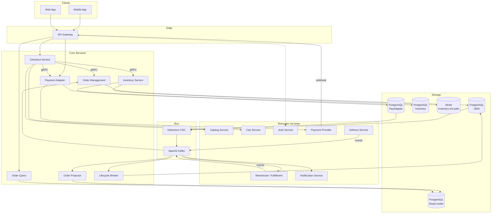
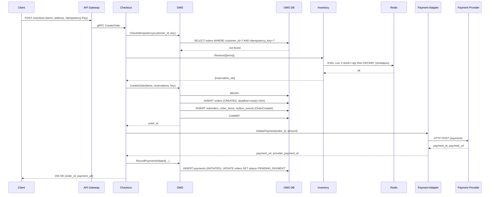
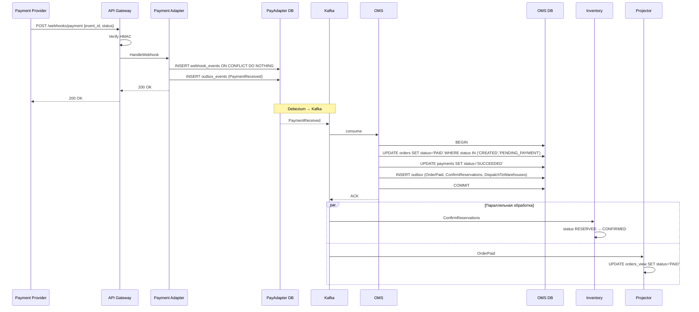
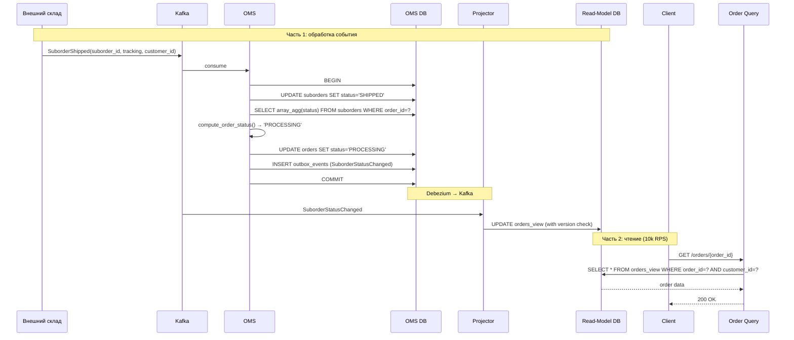

# Техническое решение: Оформление заказа на маркетплейсе

## 1. Введение

«Заказ товара на маркетплейсе» — это техническое решение для системы оформления заказов в B2C-маркетплейсе с многими селлерами. Проект сосредоточен на критическом пути от инициации чекаута до подтверждения оплаты заказа и его передачи в фулфилмент. Архитектура построена с учётом высоких нагрузок (целевая аудитория 30 млн MAU, до 150 RPS на запись и 10k RPS на чтение в пиковых сценариях), требований к финансовой консистентности и устойчивости к сбоям.

Ключевые архитектурные принципы: микросервисная декомпозиция с изоляцией хранилищ, CQRS-разделение записи и чтения через event-driven обновление read-model, распределённая транзакция через паттерн Saga с явными компенсациями, идемпотентность всех изменяющих операций на нескольких уровнях, и Transactional Outbox для надёжной интеграции с Kafka.

---

## 2. Глоссарий

| Термин | Определение |
|---|---|
| Маркетплейс | Платформа, агрегирующая множество селлеров и предоставляющая покупателям единый интерфейс для покупки их товаров. |
| Покупатель (Customer) | Зарегистрированный пользователь, оформляющий заказы. |
| Селлер (Seller) | Внешний продавец, имеющий товары на маркетплейсе. В рамках scope — внешний субъект. |
| Заказ (Order) | Агрегатная сущность верхнего уровня, объединяющая покупки покупателя у разных селлеров в рамках одной транзакции оформления. |
| Подзаказ (Suborder) | Часть заказа, относящаяся к одному селлеру/складу. Имеет независимый жизненный цикл (сборка, отгрузка, доставка). |
| Чекаут (Checkout) | Процесс оформления заказа от нажатия «Оформить» до перенаправления на платёжную страницу. |
| Inventory Reservation | Временная блокировка остатка товара на время от создания заказа до его оплаты. |
| Idempotency-Key | Уникальный идентификатор запроса от клиента, обеспечивающий безопасный повтор операций без дублирования. |
| Saga | Паттерн распределённой транзакции через последовательность локальных транзакций в разных сервисах с компенсирующими действиями при сбоях. |
| Transactional Outbox | Паттерн надёжной публикации событий: запись события в outbox-таблицу в рамках транзакции БД, асинхронная публикация в брокер отдельным процессом. |
| CQRS (Command Query Responsibility Segregation) | Разделение записи (command side) и чтения (query side) с независимыми моделями данных. |
| Read-Model | Денормализованная проекция данных, оптимизированная для чтения. Обновляется асинхронно через события. |
| Order Projector | Сервис, обновляющий read-model на основе событий из Kafka. |
| CDC (Change Data Capture) | Технология (Debezium) для отслеживания изменений в БД через WAL и публикации их в брокер. |
| At-least-once delivery | Гарантия, что сообщение будет доставлено как минимум один раз; возможны дубликаты, обрабатываемые на стороне consumer'а через идемпотентность. |
| Eventual consistency | Модель согласованности, при которой данные в разных узлах системы согласуются спустя некоторое время. |
| Shard | Логически независимый сегмент БД с собственной частью данных. Шардирование позволяет горизонтально масштабировать запись. |
| Hot Product | Товар с непропорционально высокой конкурентной нагрузкой (популярный товар в распродажу). Источник race conditions на остатки. |
| Lifecycle Worker | Фоновый сервис, обрабатывающий отложенные операции жизненного цикла заказа (таймауты оплаты, повторные попытки). |
| Webhook | HTTP-вызов от внешней системы (платёжного провайдера) для уведомления об асинхронном событии. |
| API Gateway | Входная точка системы, отвечающая за аутентификацию, маршрутизацию, rate limiting и приём webhook'ов. |
| P95 Latency | 95-й перцентиль времени отклика: 95% запросов обрабатываются быстрее этой границы. |
| RPS (Requests Per Second) | Количество запросов в секунду — метрика нагрузки. |
| MAU / DAU | Monthly / Daily Active Users — количество уникальных активных пользователей за месяц/день. |

---

## 3. Функциональные требования

**ФТ-1. Открытие чекаута.** Пользователь, имея корзину, может перейти к оформлению. Система проверяет актуальность товаров, рассчитывает стоимость доставки по селлерам, формирует список подзаказов, возвращает финальную сумму.

**ФТ-2. Создание заказа.** Пользователь подтверждает оформление. Система резервирует товары на складах атомарно, создаёт заказ и подзаказы, инициирует оплату у платёжного провайдера, возвращает пользователю URL для оплаты.

**ФТ-3. Идемпотентность чекаута.** Повторный запрос на создание заказа с тем же `Idempotency-Key` не создаёт дубликат, а возвращает результат первого запроса.

**ФТ-4. Обработка callback от платежа.** При получении webhook от платёжного провайдера система переводит заказ в статус `PAID`, инициирует фулфилмент.

**ФТ-5. Обработка таймаута оплаты.** Если за 15 минут оплата не пришла, заказ автоматически отменяется, резерв товаров снимается.

**ФТ-6. Обработка событий жизненного цикла подзаказа.** Когда внешняя система (склад/доставка) сообщает о смене статуса подзаказа, система обновляет статус и пересчитывает агрегатный статус заказа.

**ФТ-7. Получение статуса заказа.** Пользователь может запросить актуальный статус оформленного заказа: общий статус, статусы подзаказов, трек-номера, ожидаемая дата доставки.

**Out of scope:** изменение состава заказа после создания, отмена покупателем, отмена селлером, возвраты и споры, антифрод, KYC, управление селлерами, промокоды и бонусные программы, мульти-валютность.

---

## 4. Нефункциональные требования

### 4.1. Масштаб системы

| Метрика | Значение |
|---|---|
| MAU | 30 млн |
| DAU | 5 млн (≈17% от MAU) |
| Заказов в день | 250 000 |
| Заказов в секунду в пике (распродажа) | 150 RPS |

### 4.2. Нагрузка по операциям

| Операция | Пиковый RPS | Тип |
|---|---|---|
| Чтение состояния заказа | 10 000 | Read |
| Создание заказа | 150 | Write |
| Webhook'и от платежей | 150 | Write |
| События от складов/доставки | 500 | Write |
| Попытки резервирования | 500 | Write |

Соотношение чтение/запись ~67:1 — read-heavy профиль, обосновывающий CQRS.

### 4.3. Latency-цели

**Синхронные операции:**
- Открытие чекаута: P95 ≤ 500 мс
- Создание заказа: P95 ≤ 1000 мс
- Получение статуса заказа: P95 ≤ 200 мс

**Асинхронные операции:**
- Обработка callback платежа → обновление статуса: P95 ≤ 5 сек
- Передача заказа на склад: P95 ≤ 30 сек

### 4.4. Доступность

- Чекаут: **99.95%** (~4.5 часа простоя в год). Критический путь.
- Чтение статуса: **99.9%**.
- Интеграции со складами: **99%** (допустима деградация).

### 4.5. Корректность и надёжность

- **Нулевая терпимость к потере оплаченного заказа.**
- **Невозможность oversell.**
- **Идемпотентность всех изменяющих операций** на нескольких уровнях.
- **Eventual consistency между подсистемами** допустима в пределах SLA.

---

## 5. Пользовательские сценарии

### Сценарий: Оформление заказа

1. Покупатель находится на странице корзины и нажимает «Оформить заказ».
2. Система открывает чекаут: показывает товары, сгруппированные по селлерам, актуальные цены, варианты доставки, итоговую сумму.
3. Покупатель выбирает адрес доставки и способ оплаты.
4. Покупатель нажимает «Перейти к оплате».
5. Система резервирует выбранные товары, создаёт заказ, инициирует оплату, перенаправляет на страницу оплаты.
6. Покупатель оплачивает заказ и возвращается в приложение.
7. Покупатель видит подтверждение оформления и актуальный статус («Заказ принят, ожидает оплаты» → через несколько секунд «Оплачен»).

**Альтернативные ветки:**
- 2a. Товар стал недоступен → предупреждение, предложение убрать.
- 2b. Цена товара изменилась → новая цена + подтверждение.
- 5a. Не удалось зарезервировать товар → ошибка, заказ не создаётся.
- 7a. Покупатель не оплатил в течение 15 минут → автоматическая отмена, снятие резервов, уведомление.

---

## 6. Модель данных

В системе используется четыре независимых хранилища: основная БД OMS (write side), read-model БД OMS (read side), БД Inventory Service, и небольшая БД Payment Adapter для idempotency-лога.

### 6.1. OMS Write Side (основная БД заказов)



**Ключевые решения:**
- **`ORDER.id` как UUIDv7-like** с зашитым `shard_id` — приложение извлекает шард прямо из идентификатора, без отдельного lookup'а.
- **Идемпотентность через unique constraint** `(customer_id, idempotency_key)`. Привязка к пользователю исключает кросс-юзерные коллизии UUID.
- **`delivery_address` как embedded JSONB** — иммутабельный snapshot на момент заказа.
- **`price_at_order` snapshot** — цена в каталоге может меняться, в заказе остаётся согласованная.
- **`reservation_id` без FK** — cross-service ссылка на резерв в БД Inventory.
- **`provider_callback_idempotency_key`** — защита от повторной обработки webhook'ов.
- **`OUTBOX_EVENT`** — Transactional Outbox: записи добавляются в той же транзакции, что и бизнес-данные. Debezium читает Postgres WAL и публикует в Kafka.

**Шардирование:** по `customer_id` (зашитый в UUID). Все заказы одного покупателя — на одном шарде.
**Партиционирование:** по `created_at` (по месяцам).

### 6.2. OMS Read Side (read-model для чтения)



**Ключевые решения:**
- Один документ на заказ — никаких джойнов при чтении.
- `suborders_snapshot` как JSONB — все подзаказы в одной записи.
- Денормализация для превью (image_url, items_count) — без обращений к каталогу.
- `version` — монотонный счётчик из source side для защиты от out-of-order events.
- Шардирование тем же ключом, что и write side (`customer_id`).
- Каждый шард имеет master + 3 read replicas для обработки 10k RPS на чтение.

### 6.3. Inventory Service



**Ключевые решения:**
- Композитный PK `(sku, warehouse_id)` в `INVENTORY_STOCK`. Шардирование по этому же ключу.
- БД хранит источник правды; Redis — горячий путь для атомарного резервирования.

**Структура в Redis:**
```
stock:{sku}:{warehouse_id} → int (доступно к резервированию)
reservation:{reservation_id} → hash, TTL 900 сек
```

**Жизненный цикл резерва:** `ACTIVE → CONFIRMED` (после оплаты) или `ACTIVE → RELEASED` (при отмене/таймауте).

**Сверка Redis ↔ БД:** фоновый процесс Inventory Reconciler раз в 5 минут считает в БД сумму активных резервов и сверяет с Redis-счётчиком. При расхождении переписывает Redis из БД.

### 6.4. Payment Adapter (служебная БД)

Маленькая БД для idempotency webhook'ов и Outbox. Не хранит сами `PAYMENT` (они в OMS).



При получении webhook: `INSERT INTO webhook_events ON CONFLICT DO NOTHING` — атомарная дедупликация. Если новый — INSERT в outbox, Debezium публикует в Kafka.

---

## 7. Архитектура

### 7.1. Компоненты системы

**1. API Gateway** — входная точка. Аутентификация JWT, маршрутизация, rate limiting, TLS termination, приём webhook'ов.

**2. Checkout Service** — синхронный сервис чекаута. Открывает чекаут (read-heavy с параллельными вызовами) и оркестрирует Saga при создании заказа.

**3. Order Management Service (OMS)** — хозяин жизненного цикла заказов. Хранит заказы, обрабатывает события статусов, публикует бизнес-события через Outbox.

**4. Inventory Service** — управление резервированием товаров. gRPC API: `Reserve`, `Release`, `Confirm`. Redis для горячего пути + PostgreSQL для аудита.

**5. Payment Adapter** — обёртка над платёжным провайдером. Инициация платежей, приём и нормализация webhook'ов, публикация в Kafka через Outbox.

**6. Order Projector** — Kafka consumer, обновляющий read-model на основе событий из OMS.

**7. Order Query Service** — синхронный сервис чтения. Читает только из read-model.

**8. Lifecycle Worker** — фоновый сервис для отложенных операций. Развёртывается как пул реплик с использованием `FOR UPDATE SKIP LOCKED`.

**Инфраструктура:**
- PostgreSQL OMS Cluster (sharded by customer_id) — 8 шардов × (master + 3 replicas).
- PostgreSQL Read-Model Cluster (sharded by customer_id) — 8 шардов × (master + 3 replicas).
- PostgreSQL Inventory Cluster (sharded by sku/warehouse).
- PostgreSQL Payment Adapter DB.
- Redis Cluster для Inventory.
- Apache Kafka.
- Debezium для CDC.

### 7.2. Архитектурная диаграмма



### 7.3. Обоснование разделения на сервисы

| Сервис | Обоснование |
|---|---|
| Checkout vs OMS | Разный профиль: Checkout — синхронный оркестратор Saga, OMS — write-heavy event-driven хозяин жизненного цикла. |
| Inventory vs OMS | Своё хранилище (Redis), специфичная нагрузка, шардирование по другому ключу. |
| Payment Adapter vs OMS | Изоляция внешней зависимости. При смене провайдера — меняется только адаптер. |
| Query vs OMS | Классический CQRS. Read/write ratio 67:1, разные паттерны масштабирования. |
| Projector vs Query | Projector — write-side для read-model, Query — read-side. Изоляция нагрузок. |
| Lifecycle Worker | Фоновые задачи изолированы от user-facing OMS. |

### 7.4. Sync vs Async и транспорт

**Синхронные пути (юзер ждёт):** Mobile/Web → Gateway → Checkout → Inventory + OMS + Payment Adapter; Mobile/Web → Gateway → QueryAPI → Read-model.

**Асинхронные пути (через Kafka):** OMS → Outbox → Kafka → Projector / Notification / Warehouse; Payment Adapter → Outbox → Kafka → OMS; Warehouse/Delivery → Kafka → OMS; Worker → OMS_DB → Outbox → Kafka.

**Принцип:** критический путь «оформить → оплатить» — синхронно. После оплаты — async.

**Транспорт:** REST/JSON наружу, gRPC между сервисами, Kafka для асинхронных событий.

### 7.5. Гарантии доставки и идемпотентность

**Transactional Outbox** обеспечивает at-least-once delivery событий из OMS и Payment Adapter в Kafka. Запись события в outbox происходит в той же БД-транзакции, что и бизнес-операция. Debezium асинхронно читает WAL и публикует в Kafka.

**Идемпотентность многослойная:**
1. **Клиент → Checkout**: `Idempotency-Key` + UNIQUE в `orders.idempotency_key`.
2. **Payment Adapter → Provider**: свой UUID, отправляемый провайдеру.
3. **Provider → нас**: `event_id` + UNIQUE в `webhook_events`.
4. **Kafka consumers**: idempotent processing через статусные проверки и версионирование.

---

## 8. Технические сценарии

### 8.1. Открытие чекаута

Read-only сценарий построения preview без создания заказа. 5 параллельных вызовов внешних сервисов (Cart, User, Catalog, Inventory, Delivery) обязательны для P95 ≤ 500 мс.

**Алгоритм:**
1. Параллельно: получить корзину из Cart Service и адреса из User Service.
2. Параллельно: получить актуальные данные товаров (цена, селлер, склад) из Catalog и проверить доступность из Inventory (`GET stock:{sku}:{warehouse}` в Redis, без блокировок).
3. Сгруппировать items по селлерам/складам.
4. Параллельно для каждой группы: рассчитать стоимость доставки в Delivery Service.
5. Собрать preview, сравнить цены с теми, что были в корзине, добавить warnings о расхождениях.
6. Вернуть клиенту.

**Highload-аспекты:**
- Параллелизация снижает latency с суммы (~250 мс) до максимума (~50 мс).
- Read-only характер позволяет неограниченно масштабировать Checkout Service горизонтально.
- Graceful degradation: при недоступности Delivery — placeholder; при недоступности Catalog/Cart — fail-fast.

### 8.2. Создание заказа

Saga из 3 шагов с компенсациями: Reserve → CreateOrder → InitiatePayment.

**Sequence-диаграмма (счастливый путь):**



**Обработка ошибок:**

- **Дубль idempotency-ключа:** `CheckIdempotency` возвращает существующий заказ → клиенту возвращается прежний `payment_url` без побочных действий.
- **OUT_OF_STOCK:** Inventory при провале Lua-скрипта откатывает (`INCRBY`) уже сделанные DECRBY и возвращает ошибку. Checkout отвечает клиенту 409 Conflict, заказа нет.
- **OMS падает после Reserve:** Checkout вызывает `Inventory.Release(reservation_ids)` как компенсацию. Возвращает 500.
- **Provider не ответил (timeout):** Checkout переводит заказ в `PAYMENT_INITIATION_FAILED`, **не отпускает резерв** (риск oversell, если запрос всё-таки прошёл к провайдеру). Lifecycle Worker через 15+2 минут гарантированно разберётся. Это осознанный выбор consistency над availability.
- **Provider ответил отказом:** Checkout вызывает `Inventory.Release`, переводит заказ в `FAILED`, возвращает клиенту 400.

**Highload-аспекты:**
- **Конкуренция за hot products** решается атомарным Lua-скриптом в Redis: операции по одному ключу сериализуются на уровне Redis-shard за микросекунды без блокировок в БД.
- **Многослойная идемпотентность**: `Idempotency-Key` от клиента + собственный idempotent key Payment Adapter → Provider.
- **Saga с явными компенсациями.**
- **Outbox pattern**: `outbox_events` пишется в той же транзакции, что и `orders`.
- **Bottleneck-анализ**: внешний провайдер (~500 мс) — главный bottleneck латентности; БД OMS на одном шарде имеет запас 10x; Redis Inventory имеет запас 100x.

### 8.3. Обработка callback оплаты

Webhook от провайдера → дедупликация → Outbox → Kafka → OMS consumer → events fan-out.

**Sequence-диаграмма (счастливый путь):**



**Обработка ошибок и дублей:**

- **Дубль webhook от провайдера** (retry): `INSERT webhook_events ... ON CONFLICT DO NOTHING` возвращает 0 rows → отвечаем 200 OK без повторной публикации в Kafka.
- **Двойная обработка Kafka consumer'ом** (retry после сбоя): `SELECT payment FOR UPDATE`, проверяем статус. Если уже SUCCEEDED — ACK без действий.
- **Race с Lifecycle Worker** (worker уже отменил заказ): подробно в разделе 8.6 «Особые случаи».

**Highload-аспекты:**
- **Idempotency на двух уровнях**: `event_id` в `webhook_events` (от провайдера) и `provider_payment_id` в `payments` (для Kafka retry).
- **At-least-once delivery + idempotent processing = effective exactly-once.**
- **Async fan-out через Kafka**: одно событие OrderPaid → 3+ параллельных подписчика, развязанных во времени.
- **Transactional Outbox в Payment Adapter**: webhook не теряется даже при сбое адаптера между ответом провайдеру и публикацией.
- **Eventual consistency**: от COMMIT до видимости в read-model — типично <1 сек.

### 8.4. Таймаут оплаты (Lifecycle Worker)

Polling по шардам с конкурентным доступом через `FOR UPDATE SKIP LOCKED`. Buffer 2 минуты для исключения race с поздним webhook. Release резервов через Kafka.

**Sequence-диаграмма (основной путь):**

```mermaid
sequenceDiagram
    participant Worker as Lifecycle Worker
    participant OMSDB as OMS DB (shard)
    participant Kafka
    participant Inventory

    Worker->>OMSDB: SELECT WHERE deadline < now()-2m AND status='PENDING_PAYMENT'<br/>FOR UPDATE SKIP LOCKED LIMIT 100
    OMSDB-->>Worker: [order_ids batch]

    loop для каждого order
        Worker->>OMSDB: BEGIN
        Worker->>OMSDB: UPDATE orders SET status='CANCELLED' WHERE id=? AND status='PENDING_PAYMENT'
        Worker->>OMSDB: UPDATE suborders SET status='CANCELLED'
        Worker->>OMSDB: INSERT outbox_events (OrderCancelled)
        Worker->>OMSDB: COMMIT
    end

    Note over OMSDB, Kafka: Debezium → Kafka
    Kafka->>Inventory: OrderCancelled
    loop для каждого reservation_id
        Inventory->>Inventory: SELECT FOR UPDATE; if status=ACTIVE then UPDATE status='RELEASED'
        Inventory->>Inventory: INCRBY stock в Redis
    end
```

**Обработка race condition:** при `UPDATE orders` дополнительно `WHERE status='PENDING_PAYMENT'`. Если вернулось 0 строк — webhook опередил Worker'а, пропускаем (заказ уже в `PAID`).

**Highload-аспекты:**
- **`FOR UPDATE SKIP LOCKED`** — нативный паттерн PostgreSQL для конкурентной обработки заданий несколькими worker-инстансами без distributed lock.
- **Batch size 100** — компромисс между overhead итераций и длительностью блокировок.
- **Развёртывание как пул реплик** — любой worker берёт любой шард, естественная балансировка.
- **Release через Kafka, а не gRPC**: Worker отвечает только за надёжную запись в OMS_DB + outbox; Inventory подхватывает асинхронно. Гарантия at-least-once.
- **Идемпотентность Inventory consumer**: проверка `status='ACTIVE'` перед UPDATE.
- **Bottleneck-анализ**: 8 шардов × 30 batch'ей/мин × 100 заказов = 24000/мин = 400/сек. Запас 10x от пиковых отмен.

### 8.5. Обработка событий жизненного цикла + чтение статуса

End-to-end путь: событие от внешнего склада → write side OMS → Outbox → Kafka → projector → read-model → query API → пользователь.

**Sequence-диаграмма (две части):**



**Обработка дублей событий:** перед `UPDATE suborders` делается `SELECT ... FOR UPDATE` с проверкой текущего статуса. Если уже `SHIPPED` или дальше по lifecycle — ACK без действий (повторное событие из retry consumer'а).

**Highload-аспекты:**
- **Read path полностью изолирован от write**: Query Service не имеет доступа к OMS_DB.
- **Шардирование = отсутствие scatter**: запрос с `customer_id` в JWT → прямой роутинг в нужный шард.
- **Versioning против out-of-order events**: Projector обновляет read-model только если версия события больше последней применённой.
- **Read replicas для масштабирования чтения**: 10k RPS распределяется на 8 × 3 = 24 реплики ≈ 400 RPS на реплику.
- **Eventual consistency**: лаг от COMMIT до видимости — миллисекунды-секунды.

### 8.6. Особые случаи

#### Случай 1: Race между Lifecycle Worker и webhook оплаты

**Ситуация:** пользователь оплатил на 14:59 минуте. Worker мог успеть отменить заказ до того, как webhook от провайдера дошёл.

**Решение:**
1. Buffer 2 минуты в Worker'е: `payment_deadline < now() - interval '2 minutes'`.
2. Условный UPDATE при обработке webhook: `WHERE status IN ('CREATED', 'PENDING_PAYMENT')`.
3. Ветка `PAID_LATE`: при 0 rows обновлено — заказ переводится в `PAID_LATE`, инициируется автоматический возврат денег у провайдера, пользователь получает извинительное уведомление.

**Trade-off:** consistency над availability. Лучше редкий «опоздавший платёж» с автоматическим refund, чем потерянная оплата.

#### Случай 2: Двойная обработка webhook'а Kafka consumer'ом

**Ситуация:** OMS-консьюмер обработал событие, успел COMMIT, но не успел ACK в Kafka (упал, рестарт). Kafka переотправит то же событие.

**Решение:**
- В `payments` unique constraint на `provider_callback_idempotency_key`.
- Перед обновлением OMS делает `SELECT ... FOR UPDATE`. Если уже SUCCEEDED — ACK без действий.
- Аналогично для Inventory (`status='ACTIVE'`) и Projector (version check).

**Гарантия:** at-least-once delivery + idempotent processing = effective exactly-once.

---

## 9. Компромиссы и ограничения

1. **Saga вместо 2PC** — распределённые транзакции через сагу с компенсациями. 2PC отвергнут из-за внешнего провайдера платежей.
2. **Eventual consistency между write и read side** допустима в пределах <1 сек. Цена — короткое окно расхождения статуса для пользователя.
3. **Hybrid storage Inventory (Redis + Postgres)**. Redis — горячий путь, БД — source of truth. Цена — окно расхождения до 5 минут, разрешаемое Reconciler'ом. В этом окне теоретически возможны минорные oversell, разрешаемые операционно.
4. **Полное шардирование с самого начала.** Нагрузка пограничная для одной ноды, но шардирование обосновано как стратегическое решение под рост и распродажные пики ×5–10.
5. **Outbox + Debezium вместо прямой публикации в Kafka.** Цена — лаг публикации (миллисекунды), выигрыш — гарантия at-least-once для финансовых событий.
6. **Замена платёжного провайдера** возможна без изменения OMS — только через замену Payment Adapter.
