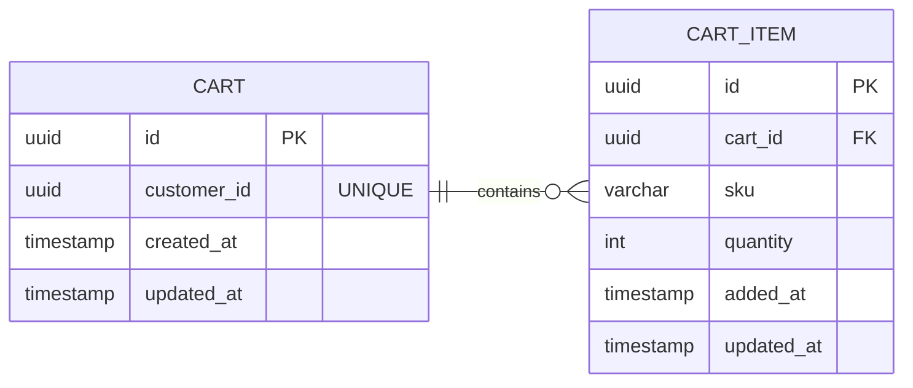
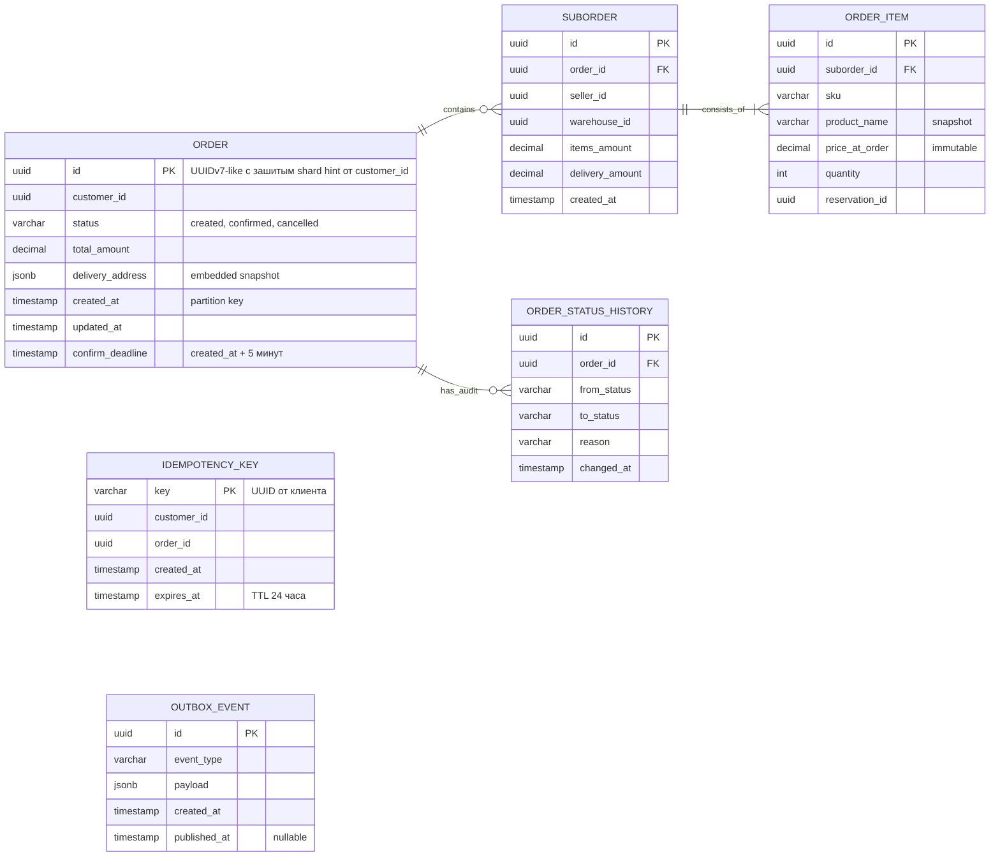
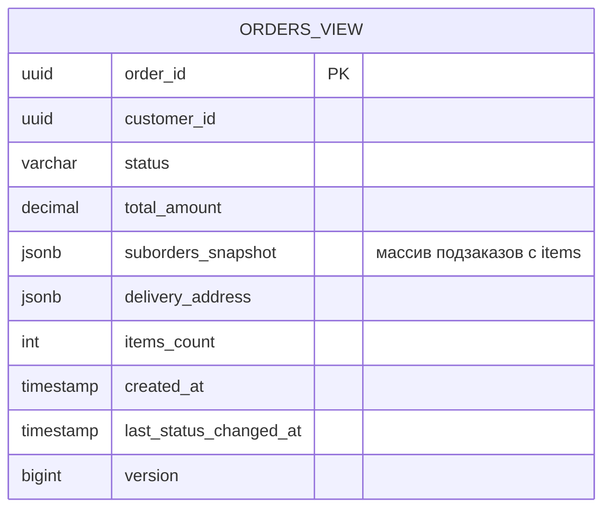
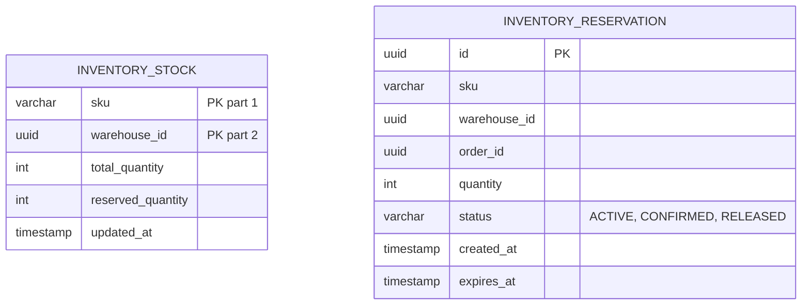
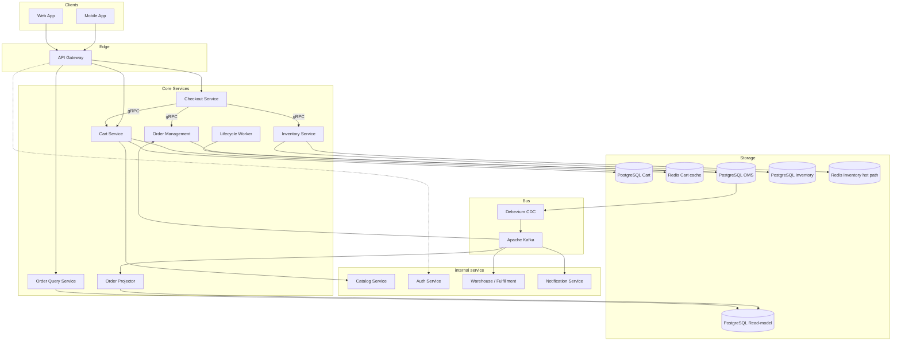
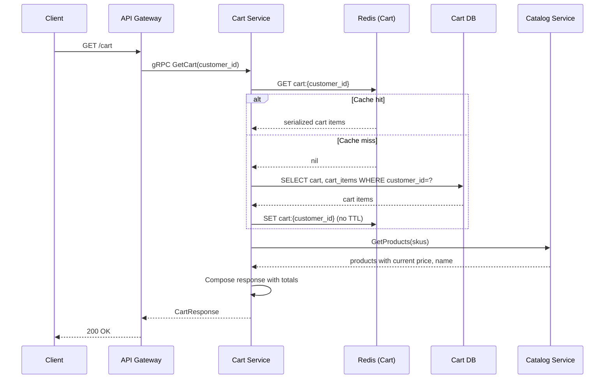
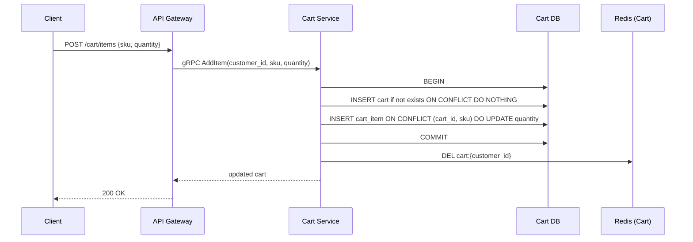
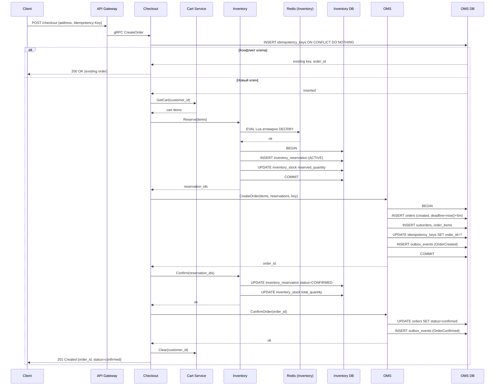
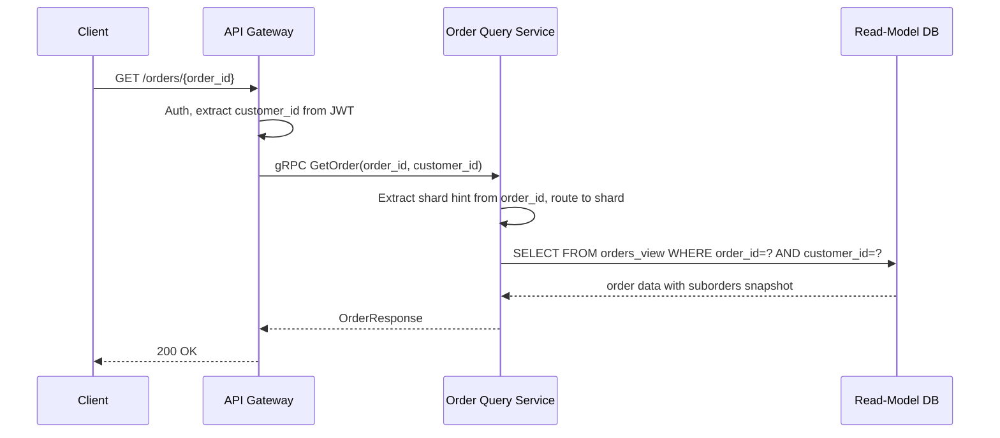
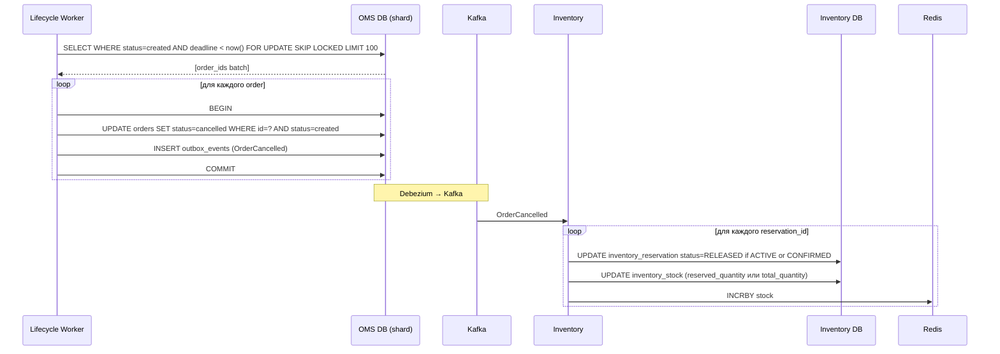

# Техническое решение: Оформление заказа на маркетплейсе

## 1. Введение

Техническое решение описывает highload-систему оформления заказа в B2C-маркетплейсе. Система поддерживает работу с корзиной (добавление, удаление, изменение количества товаров), оформление заказа на основе корзины с атомарной фиксацией остатков, и просмотр истории заказов пользователем.

Целевая нагрузка: до 2 000 RPS на создание заказов и 10 000 RPS на чтение корзин и заказов. Ключевые архитектурные принципы: микросервисная декомпозиция с изоляцией хранилищ, CQRS-разделение записи и чтения через event-driven обновление read-model, распределённая транзакция оформления через паттерн Saga с явными компенсациями, идемпотентность операции оформления, и Transactional Outbox для надёжной интеграции с Kafka.

---

## 2. Глоссарий

| Термин | Определение |
|---|---|
| Маркетплейс | Платформа, агрегирующая множество селлеров и предоставляющая покупателям единый интерфейс для покупки товаров. |
| Покупатель (Customer) | Зарегистрированный пользователь, оформляющий заказы. |
| Селлер (Seller) | Внешний продавец, имеющий товары на маркетплейсе. |
| Корзина (Cart) | Набор товаров, выбранных пользователем для оформления. |
| Позиция корзины (Cart Item) | Отдельный товар и его количество в составе корзины. |
| Заказ (Order) | Подтверждённая заявка пользователя на покупку товаров. |
| Подзаказ (Suborder) | Часть заказа, относящаяся к одному селлеру/складу. |
| Позиция заказа (Order Item) | Отдельный товар и его количество в составе заказа. |
| Остаток (Stock) | Доступное для продажи количество товара на складе. |
| Резервирование (Reservation) | Временная фиксация части остатка под конкретный заказ. |
| Чекаут (Checkout) | Процесс подтверждения и оформления заказа. |
| Idempotency-Key | Уникальный идентификатор запроса от клиента, обеспечивающий безопасный повтор операций без дублирования. |
| Saga | Паттерн распределённой транзакции через последовательность локальных транзакций в разных сервисах с компенсирующими действиями при сбоях. |
| Transactional Outbox | Паттерн надёжной публикации событий: запись события в outbox-таблицу в рамках транзакции БД, асинхронная публикация в брокер отдельным процессом. |
| CQRS | Command Query Responsibility Segregation — разделение записи и чтения с независимыми моделями данных. |
| Read-Model | Денормализованная проекция данных, оптимизированная для чтения. Обновляется асинхронно через события. |
| CDC | Change Data Capture — технология (Debezium) для отслеживания изменений в БД через WAL и публикации их в брокер. |
| At-least-once delivery | Гарантия, что сообщение будет доставлено как минимум один раз; возможны дубликаты, обрабатываемые на стороне consumer'а через идемпотентность. |
| Eventual consistency | Модель согласованности, при которой данные в разных узлах системы согласуются спустя некоторое время. |
| Shard | Логически независимый сегмент БД с собственной частью данных. |
| Hot Product | Товар с непропорционально высокой конкурентной нагрузкой (популярный товар в распродажу). |
| Lifecycle Worker | Фоновый сервис, обрабатывающий отложенные операции жизненного цикла заказа. |
| API Gateway | Входная точка системы: аутентификация, маршрутизация, rate limiting. |
| P95 Latency | 95-й перцентиль времени отклика. |
| RPS | Requests Per Second — метрика нагрузки. |
| Статус заказа | Текущее состояние заказа: `created`, `confirmed` или `cancelled`. |

---

## 3. Функциональные требования

**ФТ-1. Работа с корзиной.** Пользователь может добавлять товары в корзину, удалять их, изменять количество, просматривать актуальный состав корзины. Каждая позиция содержит `product_id`, название, цену, количество.

**ФТ-2. Просмотр итоговой информации.** Система отображает список товаров в корзине, стоимость каждой позиции, итоговую сумму заказа.

**ФТ-3. Оформление заказа.** Пользователь подтверждает оформление, система проверяет доступность товаров, резервирует остатки атомарно, создаёт заказ в статусе `created`, подтверждает резерв и переводит заказ в `confirmed`. Возвращает пользователю результат операции.

**ФТ-4. Идемпотентность оформления.** Повторный запрос на оформление с тем же `Idempotency-Key` не создаёт дубликат, а возвращает результат первого запроса.

**ФТ-5. Работа с остатками.** Система учитывает доступный остаток товара, не допускает оформления заказа на количество, превышающее остаток, и предотвращает одновременное подтверждение одного остатка в нескольких заказах сверх доступного количества.

**ФТ-6. Таймаут резерва.** Если заказ в статусе `created` не переходит в `confirmed` в течение заданного времени (по причине сбоя), Lifecycle Worker отменяет заказ (статус `cancelled`), снимает резервы товаров.

**ФТ-7. Просмотр истории заказов.** Пользователь может просматривать список своих заказов: состав, итоговую сумму, текущий статус.

**ФТ-8. Просмотр конкретного заказа.** Пользователь может получить детали конкретного заказа: статус, состав, итоговую сумму.

---

## 4. Нефункциональные требования

### 4.1. Нагрузка

| Операция | Пиковый RPS | Тип |
|---|---|---|
| Чтение корзины | 7 000 | Read |
| Чтение заказов (история, детали) | 3 000 | Read |
| Создание заказа | 2 000 | Write |
| Изменения корзины (add/remove/update) | 1 500 | Write |
| Попытки резервирования | 6 000 | Write |

Совокупное чтение корзин и заказов — **10 000 RPS**, создание заказов — **2 000 RPS**. Соотношение чтение/запись ~5:1 обосновывает CQRS.

### 4.2. Latency-цели

| Операция | P95 |
|---|---|
| Получение корзины | ≤ 150 мс |
| Изменения корзины | ≤ 200 мс |
| Оформление заказа | ≤ 300 мс |
| Получение информации о заказе | ≤ 200 мс |

### 4.3. Доступность

- Оформление заказа: **99.95%**.
- Чтение корзин и заказов: **99.9%**.

### 4.4. Корректность и надёжность

- **Нулевая терпимость к потере подтверждённого заказа.**
- **Невозможность oversell**: товар не подтверждается в количестве, превышающем остаток.
- **Идемпотентность операции оформления** на нескольких уровнях.
- **Корректная обработка повторной отправки** запроса на оформление.
- **Зафиксированный состав** подтверждённого заказа (immutable snapshot).
- **Eventual consistency** между write и read side истории заказов допустима в пределах SLA (<1 сек типично).

### 4.5. Масштабируемость

Горизонтальное масштабирование по контурам: работа с корзиной (Cart Service), оформление заказов (Checkout Service, OMS), хранение и чтение заказов (read-model), обработка остатков (Inventory Service).

---

## 5. Пользовательские сценарии

### Сценарий 1: Сбор корзины

1. Покупатель находит товар и нажимает «Добавить в корзину».
2. Система добавляет позицию в корзину (или увеличивает количество, если товар уже там).
3. Покупатель открывает корзину и видит список товаров, цену каждой позиции, итоговую сумму.
4. Покупатель может изменить количество товара или удалить его из корзины.

### Сценарий 2: Оформление заказа

1. Покупатель находится в корзине и нажимает «Оформить заказ».
2. Система проверяет актуальность товаров и наличие остатков.
3. Покупатель выбирает адрес доставки и подтверждает оформление.
4. Система резервирует выбранные товары, создаёт заказ, подтверждает резерв.
5. Покупатель получает подтверждение оформления заказа с его номером.

**Альтернативные ветки:**

- 2a. Какой-то товар стал недоступен → предупреждение, предложение убрать товар или вернуться в корзину.
- 4a. Не удалось зарезервировать товар (раскупили в момент оформления) → ошибка, заказ не создаётся.

### Сценарий 3: Просмотр истории заказов

1. Покупатель открывает раздел «Мои заказы».
2. Система отображает список заказов с пагинацией: номер заказа, дата, итоговая сумма, статус.
3. Покупатель может открыть детали конкретного заказа: статус, состав, сумма.

---

## 6. Модель данных

В системе используется четыре независимых хранилища: БД Cart Service (PostgreSQL + Redis cache), основная БД OMS (write side), read-model БД OMS (read side), БД Inventory Service.

### 6.1. Cart Service



**Ключевые решения:**

- **Одна корзина на пользователя** — `UNIQUE (customer_id)`. При первом добавлении товара корзина создаётся, дальше дополняется.
- **Без snapshot цены и названия** — корзина хранит только `sku` и `quantity`. Актуальные цена и название берутся из Catalog Service при отображении. Так гарантируется, что пользователь видит свежую цену.
- **Redis-кэш** хранит сериализованное состояние корзины: `cart:{customer_id}` → JSON с массивом items. TTL не задан (cache invalidation при write).
- **Шардирование** по `customer_id` в обеих частях (PostgreSQL и Redis).

### 6.2. OMS Write Side



**Ключевые решения:**

- **`ORDER.id` как UUIDv7-like** с зашитым shard hint, выводимым из `customer_id` при создании. Это позволяет роутить запрос `GET /orders/{order_id}` в правильный шард без отдельного lookup'а; проверка прав (что заказ принадлежит этому customer_id) выполняется на уровне приложения с JWT.
- **Идемпотентность через отдельную таблицу `IDEMPOTENCY_KEY`** — не привязана к партиционированной таблице `orders`, что позволяет иметь UNIQUE constraint по `key`. Таблица сама партиционируется по `created_at` для управления ростом.
- **`delivery_address` как embedded JSONB** — иммутабельный snapshot на момент заказа.
- **`price_at_order` и `product_name` как snapshot** в `ORDER_ITEM` — состав подтверждённого заказа неизменен, не зависит от изменений в Catalog.
- **`reservation_id` без FK** — cross-service ссылка на резерв в БД Inventory.
- **`OUTBOX_EVENT`** — Transactional Outbox для надёжной публикации событий в Kafka через Debezium.
- **`confirm_deadline`** — крайний срок для перевода в `confirmed`. Если не успели — Lifecycle Worker отменит.

**Шардирование:** по `customer_id`. Все заказы одного покупателя на одном шарде.
**Партиционирование:** `orders` по `created_at` (по месяцам). Таблица `idempotency_keys` партиционируется отдельно по `created_at`.

### 6.3. OMS Read Side (read-model)



**Ключевые решения:**

- Один документ на заказ — никаких JOIN при чтении.
- `suborders_snapshot` как JSONB — все подзаказы и items в одной записи.
- `version` — монотонный счётчик для защиты от out-of-order событий.
- Шардирование по `customer_id`, синхронно с write side.
- Каждый шард: master + 3 read replicas для обслуживания 3 000 RPS чтения заказов.

### 6.4. Inventory Service



**Ключевые решения:**

- Композитный PK `(sku, warehouse_id)` в `INVENTORY_STOCK`. Шардирование по этому же ключу.
- БД хранит источник правды; Redis — горячий путь для атомарных операций.

**Структура в Redis:**

```
stock:{sku}:{warehouse_id} → int (доступно к резервированию)
reservation:{reservation_id} → hash, TTL 300 сек
```

**Жизненный цикл резерва:** `ACTIVE → CONFIRMED` (после подтверждения заказа) или `ACTIVE → RELEASED` (при отмене/таймауте).

**Запись в БД синхронна с Redis:** в рамках одного gRPC-вызова `Inventory.Reserve` выполняется Lua-скрипт в Redis (`DECRBY` атомарно), затем INSERT записи `inventory_reservation` со статусом `ACTIVE` и UPDATE `inventory_stock.reserved_quantity`. При сбое в БД-транзакции — компенсирующий `INCRBY` в Redis. Reconciler выступает страховкой на случай сбоев Redis (failover, частичная потеря данных), сверяя счётчики раз в 5 минут.

---

## 7. Архитектура

### 7.1. Компоненты системы

**1. API Gateway** — входная точка. Аутентификация JWT, маршрутизация, rate limiting, TLS termination.

**2. Cart Service** — управление корзинами. Синхронный сервис; PostgreSQL для durability + Redis-кэш для чтения. Read 7 000 RPS, write 1 500 RPS.

**3. Checkout Service** — синхронный оркестратор оформления. При нажатии «Оформить» запускает Saga: проверка идемпотентности → Reserve → CreateOrder → ConfirmReservation → UpdateOrder.

**4. Order Management Service (OMS)** — хозяин жизненного цикла заказов. Хранит заказы, обрабатывает таймауты резерва, публикует бизнес-события через Outbox.

**5. Inventory Service** — управление резервированием товаров. gRPC API: `Reserve`, `Release`, `Confirm`. Redis для конкурентных атомарных операций + PostgreSQL для аудита.

**6. Order Query Service** — синхронный read-сервис: история заказов, детали заказа. Читает только из read-model. Read 3 000 RPS.

**7. Order Projector** — Kafka consumer, обновляющий read-model на основе событий OMS.

**8. Lifecycle Worker** — фоновый сервис: отмена заказов в `created`, не перешедших в `confirmed` в течение `confirm_deadline`. Развёртывается как пул реплик с `FOR UPDATE SKIP LOCKED`.

**Инфраструктура:**

- PostgreSQL Cart Cluster (sharded by customer_id) + Redis Cluster для кэша корзин.
- PostgreSQL OMS Cluster (sharded by customer_id).
- PostgreSQL Read-Model Cluster (sharded by customer_id) — master + 3 replicas на шард.
- PostgreSQL Inventory Cluster (sharded by sku/warehouse) + Redis Cluster для горячего пути.
- Apache Kafka.
- Debezium для CDC.

### 7.2. Архитектурная диаграмма



### 7.3. Обоснование разделения на сервисы

| Сервис | Обоснование |
|---|---|
| Cart vs OMS | Эфемерная корзина с высокой read-нагрузкой и Redis-кэшем — отдельный профиль от транзакционного OMS. |
| Checkout vs OMS | Checkout — синхронный оркестратор Saga; OMS — хозяин жизненного цикла. Разные паттерны. |
| Inventory vs OMS | Своё хранилище (Redis), специфичная конкурентная нагрузка, шардирование по другому ключу. |
| Query vs OMS | Классический CQRS. Read/write 5:1, разные паттерны масштабирования. |
| Projector vs Query | Projector — write-side для read-model, Query — read-side. Изоляция нагрузок. |
| Lifecycle Worker | Фоновые задачи изолированы от user-facing OMS. |

### 7.4. Sync vs Async и транспорт

**Синхронные пути:** Mobile/Web → Gateway → Cart/Checkout/QueryAPI → внутренние сервисы и БД.

**Асинхронные пути:** OMS → Outbox → Kafka → Projector / Inventory / Notification / Warehouse; Worker → OMS_DB → Outbox → Kafka → Inventory.

**Принцип:** критический путь оформления — синхронно. Всё, что после подтверждения заказа (передача на склад, обновление read-model, уведомления) — async.

**Транспорт:** REST/JSON наружу, gRPC между сервисами, Kafka для асинхронных событий.

### 7.5. Гарантии доставки и идемпотентность

**Transactional Outbox** обеспечивает at-least-once delivery событий из OMS в Kafka. Запись события в `outbox_events` происходит в той же БД-транзакции, что и бизнес-операция. Debezium асинхронно читает WAL и публикует в Kafka.

**Идемпотентность многослойная:**

1. **Клиент → Checkout**: `Idempotency-Key` от клиента + UNIQUE в таблице `idempotency_keys`.
2. **Внутри Saga**: атомарные операции в Inventory (Lua-скрипты) и в OMS (локальные транзакции).
3. **Kafka consumers**: idempotent processing через статусные проверки и версионирование.

---

## 8. Технические сценарии

### 8.1. Получение корзины (Read, 7 000 RPS пиково)

Самая частая операция системы. Чтение идёт через Redis-кэш, fallback в PostgreSQL при cache miss.

**Алгоритм:**

1. Клиент отправляет в API Gateway запрос `GET /cart`.
2. Gateway перенаправляет запрос в Cart Service.
3. Cart Service пытается получить корзину из Redis по ключу `cart:{customer_id}`.
4. При cache hit — десериализует и возвращает.
5. При cache miss — читает из PostgreSQL, сохраняет в Redis, возвращает клиенту.
6. Cart Service параллельно запрашивает у Catalog Service актуальные цены и названия товаров по SKU.
7. Cart Service формирует итоговый ответ: позиции с актуальными ценами, итоговая сумма.

**Sequence-диаграмма:**



**Highload-аспекты:**

- **Redis-кэш** обслуживает большинство запросов; одна нода Redis Cluster даёт десятки тысяч ops/sec.
- **Шардирование Cart_Redis и Cart_DB** по `customer_id` — запрос идёт сразу в нужный шард.
- **Cache invalidation на write**: при изменении корзины ключ удаляется или перезаписывается, eventual consistency исключена для собственной корзины пользователя.
- **Stateless Cart Service** масштабируется горизонтально без ограничений.

### 8.2. Изменение корзины (Write, 1 500 RPS пиково)

Операции добавления товара, изменения количества, удаления.

**Алгоритм (на примере добавления товара):**

1. Клиент отправляет в API Gateway запрос `POST /cart/items` с `{sku, quantity}`.
2. Gateway перенаправляет в Cart Service.
3. Cart Service выполняет в одной транзакции PostgreSQL: создаёт корзину если её нет, добавляет позицию (или увеличивает количество при наличии).
4. Cart Service инвалидирует Redis-кэш: `DEL cart:{customer_id}`.
5. Клиенту возвращается обновлённое состояние корзины.

**Sequence-диаграмма:**



**Highload-аспекты:**

- **ON CONFLICT DO UPDATE** — атомарное upsert поведение, без дополнительных запросов.
- **Write-through invalidation**: после COMMIT удаляем ключ в Redis. При следующем чтении произойдёт fetch из БД.
- **Транзакция в одной БД одного шарда** — низкая latency, никаких распределённых блокировок.

### 8.3. Оформление заказа (Write, 2 000 RPS пиково)

Saga из четырёх шагов с явными компенсациями: проверка идемпотентности → Reserve → CreateOrder (status=created) → ConfirmReservation → UpdateOrder (status=confirmed).

**Алгоритм:**

1. Клиент отправляет в API Gateway запрос `POST /checkout` с телом `{address, Idempotency-Key}`.
2. Gateway перенаправляет в Checkout Service.
3. Checkout проверяет идемпотентность: `INSERT INTO idempotency_keys (key, customer_id) ON CONFLICT DO NOTHING`. Если ключ уже был — возвращает существующий `order_id`.
4. Checkout читает текущую корзину пользователя из Cart Service.
5. Checkout вызывает `Inventory.Reserve(items)` — атомарно резервирует все товары в Redis (Lua-скрипт) с синхронной записью в Inventory DB.
6. Checkout вызывает `OMS.CreateOrder` — в одной транзакции создаются `orders` (status=`created`), `suborders`, `order_items`, обновляется `idempotency_keys.order_id`, пишется outbox-событие `OrderCreated`.
7. Checkout вызывает `Inventory.Confirm(reservation_ids)` — резервы переходят в `CONFIRMED`, `inventory_stock.total_quantity` уменьшается.
8. Checkout вызывает `OMS.ConfirmOrder` — `orders.status` обновляется на `confirmed`, пишется outbox-событие `OrderConfirmed`.
9. Checkout очищает корзину пользователя через `Cart.Clear`.
10. Клиенту возвращается `order_id` и статус `confirmed`.

**Sequence-диаграмма:**



**Обработка ошибок:**

- **Дубль idempotency-ключа:** `INSERT ON CONFLICT` возвращает существующую запись, клиенту отдаётся прежний `order_id`.
- **OUT_OF_STOCK на Reserve:** Inventory откатывает все уже сделанные DECRBY (`INCRBY`-компенсация), возвращает ошибку. Checkout отвечает клиенту 409 Conflict, заказа нет.
- **OMS падает после Reserve:** Checkout вызывает `Inventory.Release(reservation_ids)` как компенсацию, возвращает 500. Если компенсация тоже не прошла — Lifecycle Worker через таймаут разберётся.
- **ConfirmReservation падает:** заказ остаётся в `created`, Lifecycle Worker через `confirm_deadline` (5 минут) переведёт его в `cancelled` и сделает `Inventory.Release`.
- **UpdateOrder (confirmed) падает после ConfirmReservation:** аналогично — Lifecycle Worker увидит заказ в `created` и обработает.

**Highload-аспекты:**

- **Конкуренция за hot products** решается атомарным Lua-скриптом в Redis. Сериализация по ключу на уровне Redis-shard за микросекунды.
- **Многослойная идемпотентность:** UNIQUE constraint в отдельной таблице `idempotency_keys` (без партиционирования).
- **Saga с явными компенсациями** покрывает сбои на любом шаге.
- **Outbox pattern**: события `OrderCreated`, `OrderConfirmed` пишутся в той же транзакции, что и бизнес-данные.
- **Шардирование** по `customer_id` — каждое оформление работает в рамках одного шарда OMS DB (запись локальна). 2 000 RPS на 8 шардов = 250 RPS на шард — комфортная нагрузка.
- **Bottleneck-анализ:** самые медленные шаги — Reserve (Redis Lua + INSERT в InvDB) и CreateOrder (транзакция OMS). Запас по латентности при ~50 мс каждый и общем бюджете 300 мс — комфортный.

### 8.4. Получение заказа из истории (Read, 3 000 RPS пиково)

Чтение из read-model, отдельной от write-side.

**Алгоритм:**

1. Клиент отправляет в API Gateway запрос `GET /orders/{order_id}` или `GET /orders` (список).
2. Gateway аутентифицирует пользователя, извлекает `customer_id` из JWT, перенаправляет в Order Query Service.
3. Для одного заказа: Order Query извлекает shard hint из `order_id` (UUIDv7-like), идёт в нужный шард read-model, выполняет `SELECT FROM orders_view WHERE order_id=? AND customer_id=?` (проверка прав через `customer_id`).
4. Для списка заказов: шардовый ключ — `customer_id`, выполняется `SELECT FROM orders_view WHERE customer_id=? ORDER BY created_at DESC LIMIT/OFFSET`.
5. Запрос идёт на одну из read replicas шарда (round-robin балансировка).
6. Результат возвращается клиенту.

**Sequence-диаграмма:**



**Highload-аспекты:**

- **Read path полностью изолирован от write**: Order Query Service не имеет доступа к OMS DB.
- **Шардирование = отсутствие scatter**: запрос с `customer_id` в JWT и shard hint в `order_id` роутится в один конкретный шард без cross-shard query.
- **Read replicas для масштабирования**: 3 000 RPS / (8 шардов × 3 реплики) ≈ 125 RPS на реплику. Огромный запас.
- **Версионирование read-model** защищает от out-of-order событий при обновлении через Kafka.
- **Eventual consistency**: лаг от COMMIT в OMS DB до видимости в read-model — типично <1 сек.

### 8.5. Таймаут резерва (Background)

Lifecycle Worker отменяет заказы, оставшиеся в `created` дольше `confirm_deadline` (5 минут). Это страховочный механизм на случай сбоя где-то между CreateOrder и ConfirmOrder.

**Алгоритм:**

1. Lifecycle Worker по таймеру (каждые 30 секунд) обращается к шарду OMS DB.
2. Запрашивает заказы со статусом `created` и истёкшим `confirm_deadline`: `SELECT ... FOR UPDATE SKIP LOCKED LIMIT 100`.
3. Для каждого заказа открывает транзакцию: переводит в `cancelled` с фильтром `WHERE status='created'`, пишет событие `OrderCancelled` в outbox, коммитит.
4. Debezium публикует `OrderCancelled` в Kafka.
5. Inventory как consumer обрабатывает событие: для каждого `reservation_id` со статусом `ACTIVE` или `CONFIRMED` переводит в `RELEASED`, обновляет stock в БД, делает `INCRBY` в Redis.

**Sequence-диаграмма:**



**Highload-аспекты:**

- **`FOR UPDATE SKIP LOCKED`** — нативный паттерн PostgreSQL для конкурентной обработки заданий без distributed lock.
- **Условный UPDATE** с проверкой `status='created'` защищает от race: если Checkout всё-таки успел перевести в `confirmed` параллельно, Worker увидит 0 rows.
- **Release через Kafka, а не gRPC**: Worker отвечает только за надёжную запись в OMS DB + outbox; Inventory подхватывает асинхронно.
- **Идемпотентность Inventory consumer**: проверка статуса резерва перед обновлением.

### 8.6. Особые случаи

#### Случай 1: Двойная обработка события Kafka consumer'ом

**Ситуация:** OMS или Inventory consumer обработал событие, успел COMMIT, но не успел ACK в Kafka (упал, рестарт). Kafka переотправит то же событие.

**Решение:**

- Перед обновлением: `SELECT ... FOR UPDATE`, проверка текущего статуса. Если уже в целевом состоянии — ACK без действий.
- Для read-model — проверка `version` в условном UPDATE.

**Гарантия:** at-least-once delivery + idempotent processing = effective exactly-once.

#### Случай 2: Расхождение Redis ↔ Inventory DB

**Ситуация:** Redis потерял данные при failover, или INSERT в БД не прошёл после успешного DECRBY.

**Решение:**

- Inventory Reconciler раз в 5 минут проходит по `(sku, warehouse_id)`, считает в БД сумму активных резервов и сверяет с Redis-счётчиком. При расхождении переписывает Redis из БД (БД — source of truth).
- Окно неконсистентности до 5 минут.

---

## 9. Архитектурные компромиссы

1. **Saga вместо 2PC.** Распределённая транзакция оформления реализована через сагу с явными компенсациями. 2PC неприменим, так как Inventory работает с in-memory Redis на горячем пути.
2. **Hybrid storage в Inventory (Redis + PostgreSQL).** Redis обеспечивает атомарные операции для конкурентного доступа (десятки тысяч RPS на ключ для популярных товаров), PostgreSQL — source of truth для аудита и восстановления. Согласованность поддерживается Reconciler'ом.
3. **Cart Service: PostgreSQL + Redis cache.** Корзина должна сохраняться (пользователь возвращается через час и ждёт увидеть свою корзину), поэтому БД — source of truth. Redis обслуживает большую часть чтений.
4. **CQRS с отдельной read-model.** Read/write ratio 5:1 (10к на чтение vs 2к на запись) делает CQRS оправданным: write-side оптимизирована под транзакционность оформления, read-side — под быстрое чтение списков и деталей заказов с денормализацией в JSONB.
5. **Шардирование с момента запуска.** При 2 000 RPS на запись одна нода работала бы на пределе; шардирование обеспечивает запас под рост в 5–10 раз.
6. **`order_id` с зашитым shard hint.** Позволяет роутить запрос `GET /orders/{order_id}` в правильный шард без дополнительного lookup'а, при этом customer_id из JWT используется для проверки прав.
7. **Отдельная таблица `idempotency_keys`** без партиционирования. Альтернатива (UNIQUE в `orders`) невозможна из-за ограничения PostgreSQL: unique constraint партиционированной таблицы должен содержать ключ партиционирования.
8. **Outbox + Debezium вместо прямой публикации в Kafka.** Гарантирует at-least-once delivery бизнес-событий: при недоступности Kafka событие сохраняется в БД и публикуется при восстановлении.
9. **Двухфазный жизненный цикл заказа `created → confirmed`.** Промежуточный статус `created` существует короткое время между созданием записи заказа и подтверждением резерва. Это позволяет Lifecycle Worker гарантированно очистить «застрявшие» заказы при сбое любого шага саги.
